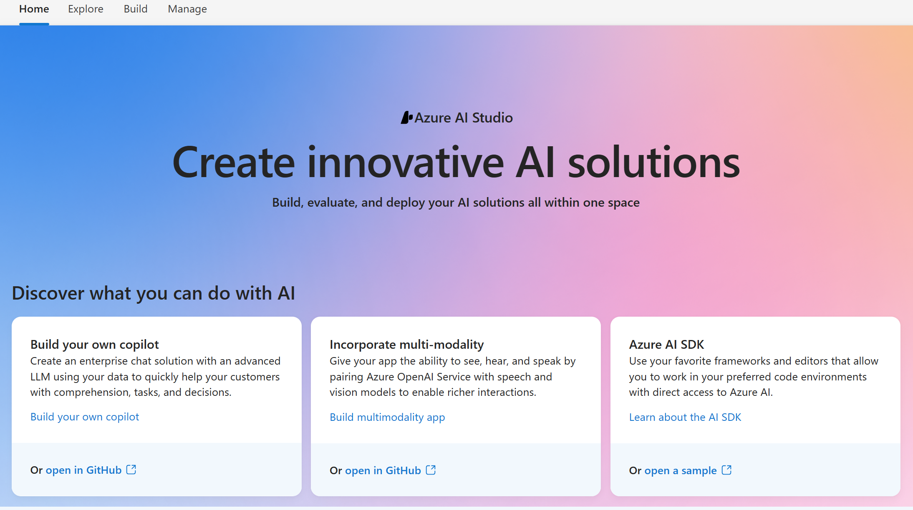

# Lab1 - Introduction to AI Studio 

Azure AI Studio brings together capabilities from across multiple Azure AI services.
Rather than visiting individual portals seperate for...
- Azure Cognitive Services for reaching out SOTA models in Vision, Language etc.
- AzureML to access AzureML platform capabilities to train, fine-tine and evaluate models
- Azure OpenAI for accessing latest models, testing prompts in playground, managing quotas for each model
- AzureML PromptFlow for facilitating LLM App development
- AzureML Model Catalog for deploying OpenWeight models or latest models from MS Research (e.g. Phi2) 
- Azure Content Safety for enabling developers to moderate their own services \
...you can access all these capabilities via Azure AI Studio

This is all good. However it takes sometime to find ones feet as to how previously familiar capabilities are accessed inside the new "Studio". 

AzureAI Studio capabilities are divided into four major parts as seen on the above horizontal menu bar…

**Home** - this is the portal main page which is a gateway to other services and services documentation and github code and samples. It looks like this is a fancy dynamic page that will highlight new service capabilities, service changes, highlights from the explore tab as well as links to individual portals it is wrapping in. 

**Explore** - this is where you can discover and try out capabilities for common use-cases. All in all this is an improved model hub which brings together a richer AzureML Model Hub extended with models from MS Resarch, NVIDA, HF model hub, HF, Nvidia where you can search between models based on your use case and access benchmark reports e.g. accuracy of gpt4 and gpt35 variants wrt llama-2 70b and 13b variants , Azure Cognitive Services (speech, vision, language models). 

Content safety is available with its full multi-modality here too. Extended capabilities around a jailbreak attack detection studio link with code ready capability, link to a best practices guide to systems prompt construction and a "protected material detection" capabilitiy that can be accessed from here too.
There exists a prompt samples which can be used as a template inside playground that may be useful for anyone that is in the early phases of their is available here too…

**Build**  - is where you will find the good old AzureML PromptFlow along with the Playground to test your prompts and model hyperparameters. Evalaution which used to a seperate flow type under PromptFlow is now a seperate "tool". Custom Neural Voice (CNV)

**Manage** - manage is where you configure and save the resources and tools required to run AzureAI Studio. e.g. connections to AI Search or external vector db's...and manage service quotas like Azure ML compute instance quotas, Azure OpenAI model quotas, AzureOpenAI PTU(Provisioned throughput capacities) and AzureOpenAI Provisioned-Managed (PTU-M) capacities...

