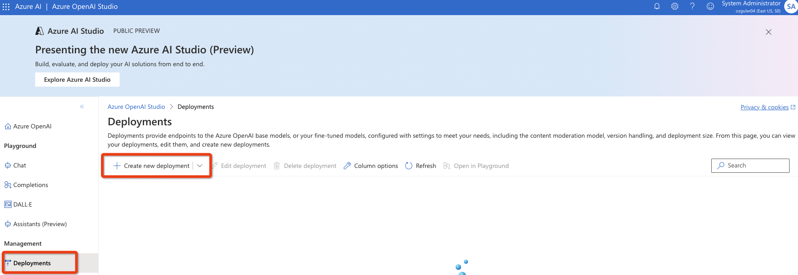

# ENVIRONMENT SETUP

Follow the guidance on [Azure MS Learn Documentation](https://learn.microsoft.com/en-us/azure/ai-studio/tutorials/deploy-copilot-ai-studio).

# Lab1 - Create a WikiPedia Chat Flow 

We will use the WikiPedia Chat Flow template in Azure AI Studio to get upto speed with the basic functionalities and concepts of PromptFlow / Azure AI Studio...
Open AI studio via https://ai.azure.com \
(Please note the "warning" at top left,  "Azure AI Studio is currently in Preview".)

## 1.1 Create a new Azure AI Studio Project 

Creating a new "AI Studio Project" in a new and dedicated AI Studio service hub is recommended to rule out any problems that may be caused by leftovers from previous deployments.

The Azure AI hub resource is the top-level Azure resource for AI Studio and provides the working environment for a team to build and manage AI applications. In Azure, resources enable access to Azure services for individuals and teams. Resources also provide a container for billing, security configuration and monitoring. (See [Azure AI Resources documentation](https://learn.microsoft.com/en-us/azure/ai-studio/concepts/ai-resources) for more...) 

If you already have a running Azure AI Search service instance and an AzureOpenAI endpoint within the same resource-group as your Azure AI Studio Hub service , AI Studio will automatically recognise them during service hub creation. If you don't have these services created beforehand create them as below before creating your Azure AI Studio Hub / Project.

### 1.1.1 Create a new Azure AI Search Service 
Create a new resource-group. \
Free or Basic tiers will suffice for the purposes of this lab.

Validate and create the service...

### 1.1.2 Launch a new Azure OpenAI Service Endpoint 

Validate and create the service...

#### 1.1.2.1 Deploy a model under AOAI endpoint 
Go to the create Azure OpenAI service endpoint on Azure portal...
Click on "Go to Azure OpenAI Studio"

Create the deployment. In this example I am deploying an gpt-35-turbo-16k 0613 model.

### 1.1.3 Create Azure AI Studio Service Hub resource and a new AI Studio Project
**Please use "EastUS2" as your Region as currently Mistral, Cohere MaaS models are deployable in selected few regions, with a common denominator as EastUS-2**

If you have an active Azure AI Search Service and an Azure OpenAI endpoint up and running in the same subscription (irrespective of resource-group settings), AI Studio will let you choose these resources during hub creation.

Once you confirm the hub resource details, AI Studio will create 
- a storage account 
- a key-vault service 
- the hub resource 
- the project 

Once you see green checkmarks next-to all individual service component you are good to go and you will see a project overview screen, similar to the one below...Choose "Build and deploy with PromptFlow" option.

