# 1.2 Introduction to PromptFlow 

Azure's PromptFlow is a specialized service designed to streamline the creation, tuning, and deployment of large language models (LLMs). It provides an intuitive interface for developers and data scientists to experiment with various prompts, datasets, and models in a collaborative environment. The service supports the full lifecycle of LLM development, from initial prototyping to production deployment. Users can customize and fine-tune models to meet specific requirements, leveraging Azure's robust infrastructure for scalability and performance. Additionally, PromptFlow integrates with other Azure AI and machine learning tools, enhancing its utility in complex AI workflows. This service is particularly useful for organizations looking to harness the power of LLMs for natural language processing tasks without managing underlying infrastructure complexities.

## 1.2.1 Launch PromptFlow on Azure AI Studio (not on Azure ML)
Launch PromptFlow from the vertical menu on the left.
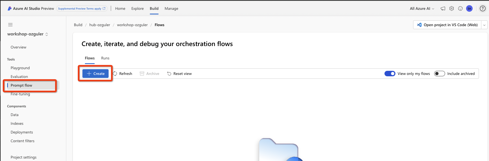

Create a sample chat flow.
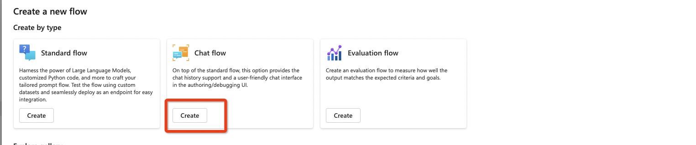

PromptFlow UI will pop up.
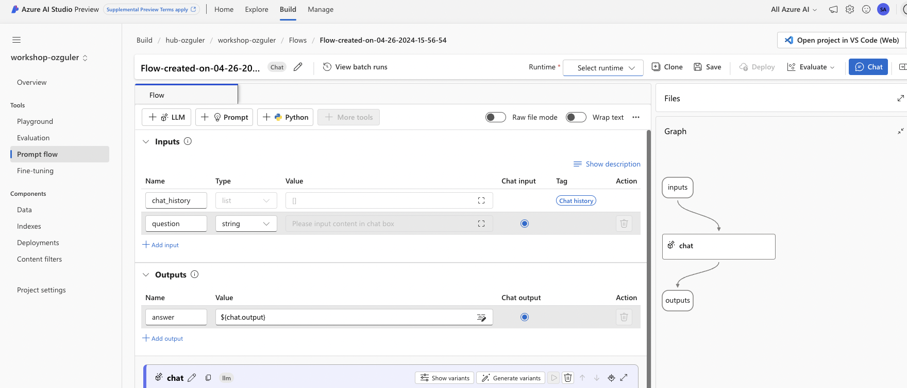

## 1.2.2 Configure a PromptFlow Runtime 
PromptFlow code runs on a container runtime which includes  app configurations and dependencies.
Container runtime runs on a compute service. This is either a standard VM you can launch and manage yourself or the new serverless compute (automatic runtime) option can be used.

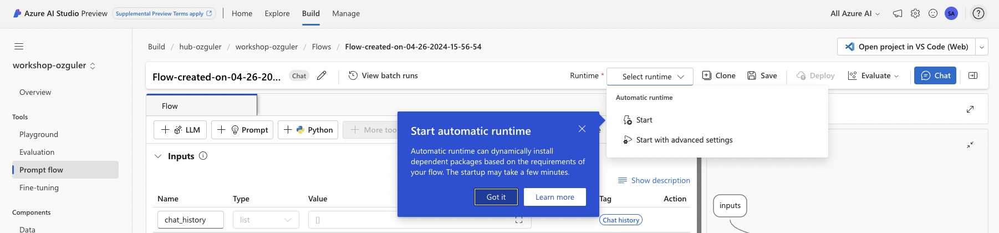

Let's use a VM rather than serverless compute for this lab.
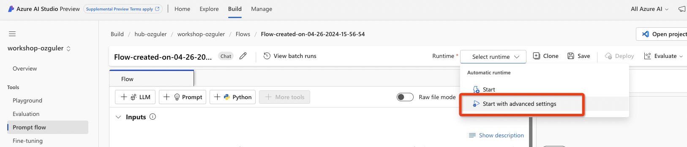

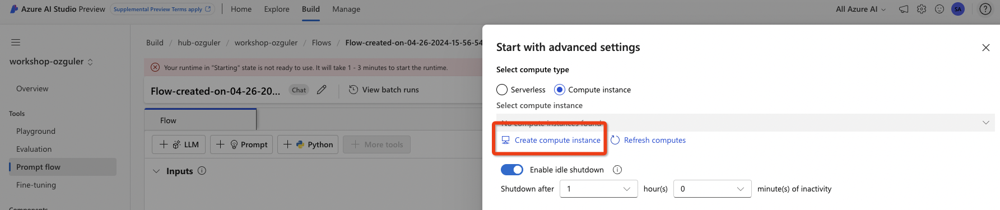

Choose a VM type...
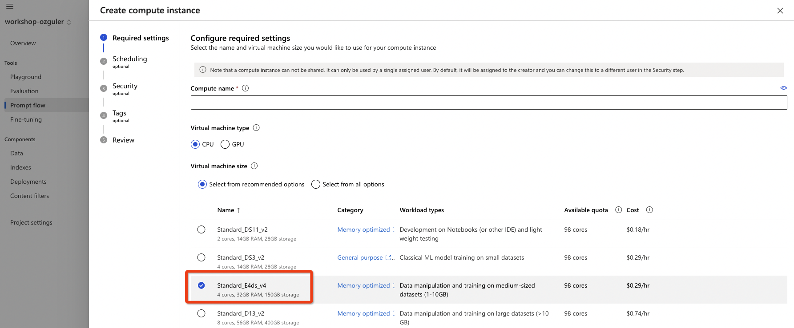

Enable ssh access to the VM...
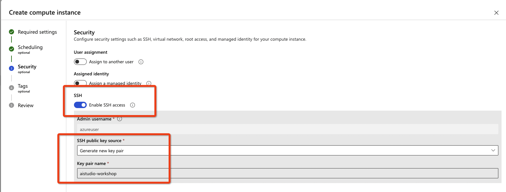

It will take 1-2 minutes for the VM to launch.
Enable ssh access to the VM...
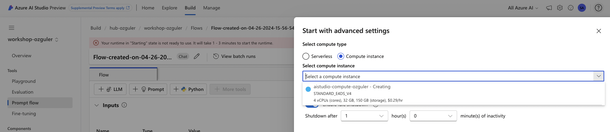

Once the lab is up and running choose the compute instance, click activate  and proceed to the flow screen again...
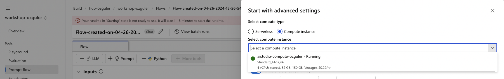

Finally, you will be able to see the compute instance you have created in the prior steps active on the flow...
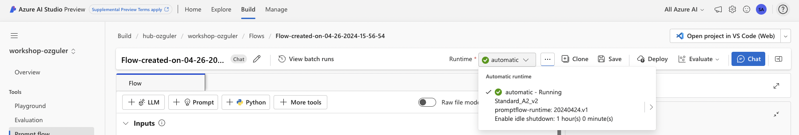

## 1.2.3 Understand the PromptFlow UI & Types of Flow Components 
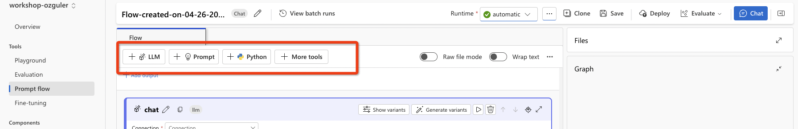

E.g. In the flow sample we are using we have an "LLM" flow step.
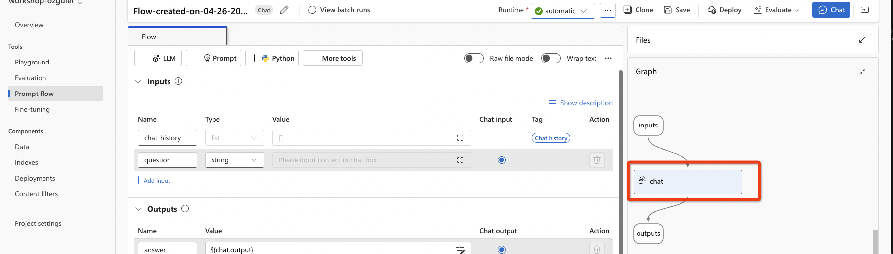

PromptFlow UI is organised as individual code modules, each visible in the UI as blocks.
Each block can be of four main types.
1. LLM Tool - points to an Azure OpenAI model deployment. \
Let's you define Advanced Features e.g. model hyperparameters, Function Calling and a prompt...\
The LLM Tool, on the other hand, is geared towards the broader aspects of managing and fine-tuning the language models themselves. This includes selecting pre-trained models, adjusting model parameters, training models on specific datasets, and integrating these models into applications. The LLM Tool provides functionalities to customize the model's architecture, performance, and output quality to better align with specific use cases or business needs.
2. Prompt Tool -  The Prompt Tool in Azure PromptFlow is designed to help users create, test, and iterate on prompts used to interact with LLMs. This tool focuses on optimizing the input prompts to achieve desired outputs from the model. It provides a user-friendly interface for experimenting with different phrasings, structures, and parameters of prompts, allowing users to see how changes affect the model's responses. This is particularly useful for tasks like crafting queries, generating text, or setting up specific scenarios to test model behavior. With the Prompt step you can have the LLM create LLM Variants. \
Each LLM variant is passed through the flow and outputs a different "generation". \
This enables fast prompt engineering.\

**Key Differences between the LLM Tool and the Prompt Tool:**
- Focus: The Prompt Tool focuses on refining the input prompts to achieve better model outputs, while the LLM Tool focuses on the configuration and fine-tuning of the models themselves.
- Usage: The Prompt Tool is used for iterating on and testing prompt variations, whereas the LLM Tool is used for selecting, customizing, and deploying LLMs.
- Scope: The Prompt Tool operates at the interaction level (how you ask questions), whereas the LLM Tool operates at the model level (how the model processes and generates responses).

3. Python Step - PromptFlow lets you write custom code to enable any feature or capability possible by writing a code.
Python Step also enables you to be able to use frameworks like Langchain or LLamaIndex.
4. More Tools Step - More Tools menu includes the following. \
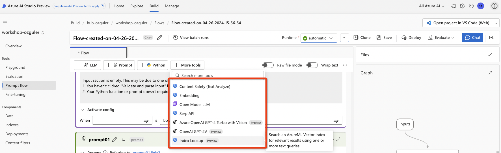
- Open Model LLM - lets you add non-OpenAI MaaS models e.g. models from Mistral, Meta (Llama-2/3) etc. 
- AzureOpenAI GPT4-Turbo with Vision (preview)
- OpenAI GPT4-V
- Embedding Step 
- Index Lookup - Vector Search Step 
- Content Safety model - to filter out prompts and/or generations for hazardous or offensive content. (More on this later)

# 1.2.2 Run the sample Chat Flow 
We will now run the sample Chat Flow by populating the LLM configuration (endpoint / deployed model details)...

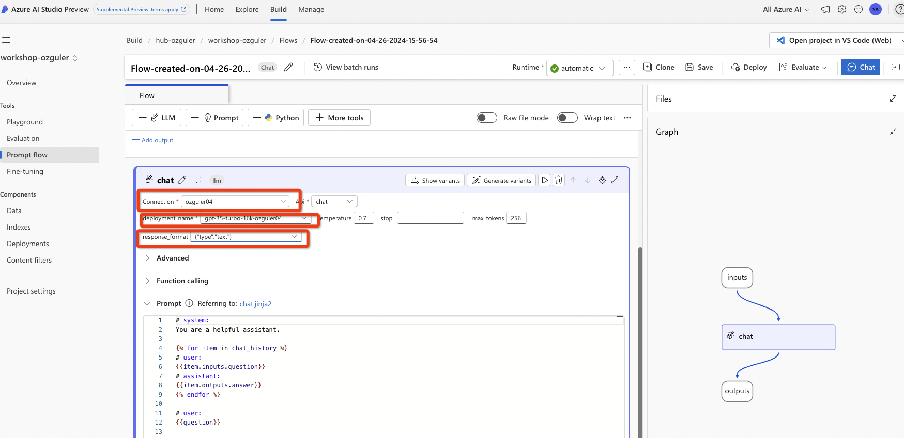

Save the Flow and click on Chat to go to the Chat UI...
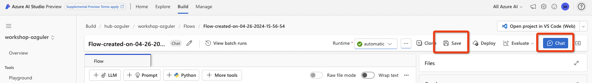

Now get familiar with the UI by prompting sample questions, this is a simple playground type of environment...

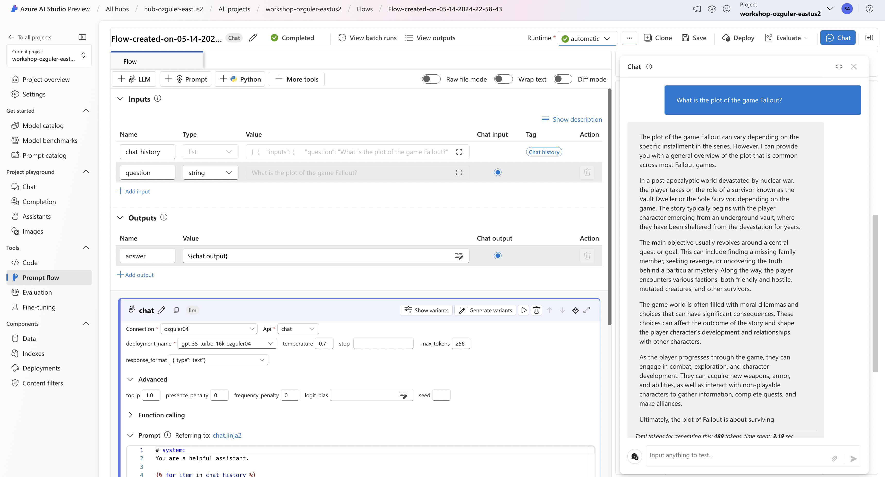

Compute instance will be taken down after following inactive time the specified by "idle-timeout" configured while creating the VM. (Configurable) \
You can start the compute instance from Project Settings, available in the vertical menu on the left if / when required...
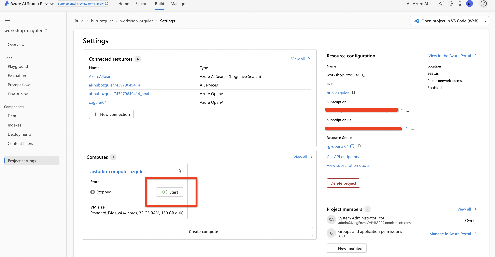

With that we have completed Lab1.2.
