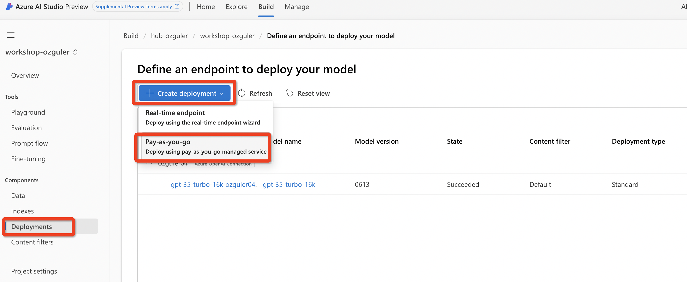
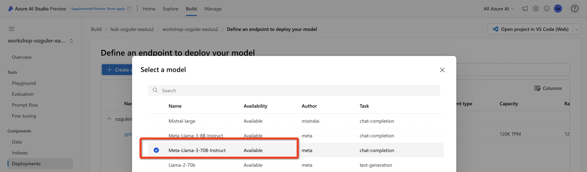
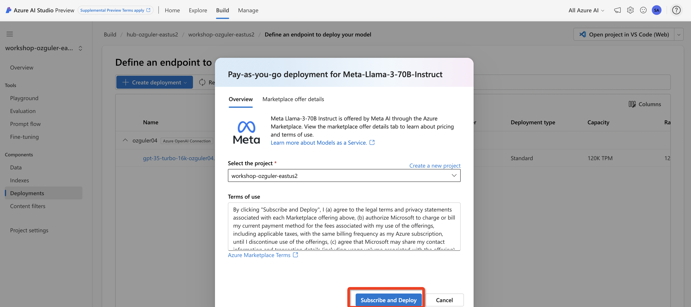
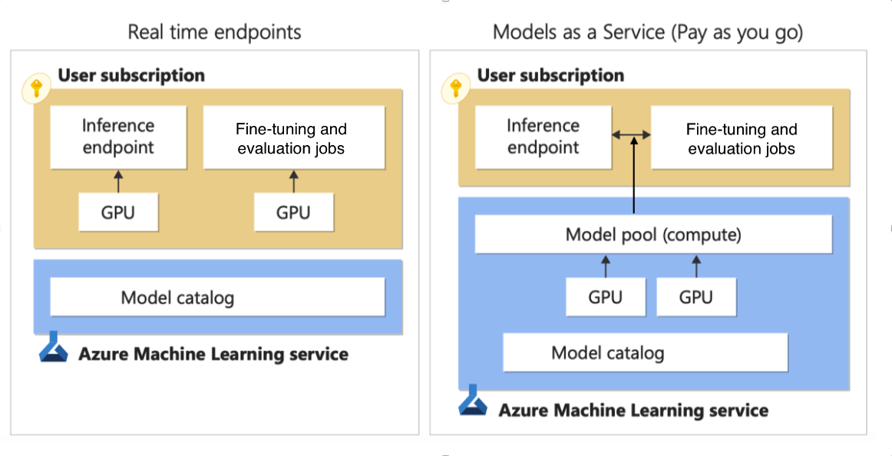

(Please do not attempt this section at the moment )
# Deploying Models from AI Studio Model Catalog 

The model catalog in Azure AI studio is the hub to discover and use a wide range of models that enable you to build Generative AI applications. The model catalog features hundreds of models across model providers such as Azure OpenAI service, Mistral, Meta, Cohere, Nvidia, Hugging Face, including models trained by Microsoft. Models from providers other than Microsoft are Non-Microsoft Products, as defined in Microsoft's Product Terms, and subject to the terms provided with the model.

(Read more on [documentation](https://learn.microsoft.com/en-us/azure/ai-studio/how-to/model-catalog-overview
))

## 1.3.1 Add non-OpenAI models as MaaS 
We can deploy models from META, Cohere, Mistral and any other model from HF Model Hub via AI Studio Model Catalog and use these models as "LLM"'s in PromptFlow.

(An Azure subscription with a valid payment method is required. Free or trial Azure subscriptions won't work.)

Note - PAYG a.k.a MaaS model deployments are only available on Azure AI Studio and not on Azure ML.
Refer to [How to deploy Meta Llama models with Azure AI Studio](https://learn.microsoft.com/en-us/azure/ai-studio/how-to/deploy-models-llama?tabs=llama-three) MS Learn documentation.

Create a PAYG model deployment... 

## 1.3.2 Add non-OpenAI models as RTE - RealTime Endpoints 
MaaS abstracts infra complexity and you can start consume LLM's via simple API calls. \
However for some variants of the models MaaS may not be available. \
An alternative is deploying the models as RTE's - RealTime endpoints. 
Advantage of deploying models as RTE is that you will bypass any quota restrictions that may exist in models MaaS offering and will have full control on the cluster to include any software package for any additional ability you are after. The down side is that you will now need to create the cluster yourself and integrate it into your flows via a "custom connection" you will need to create with the API URL and the key of your deployment endpoint. 

Refer to the "Building a Financial Recommender Lab" where we will deploy a phi-3 model to summarise financial news as an input to copilot's recommendations.

Below is a good illustration of RTE vs MaaS models...

