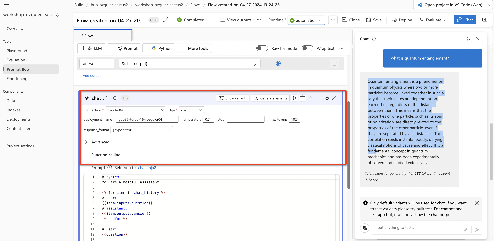
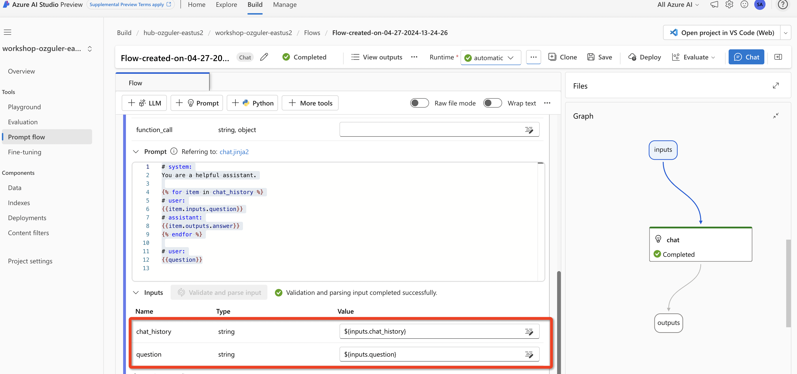
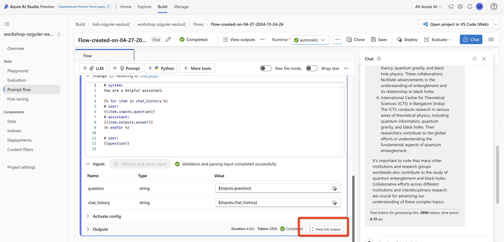
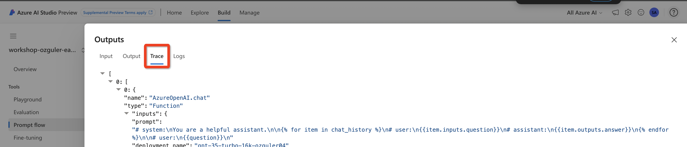
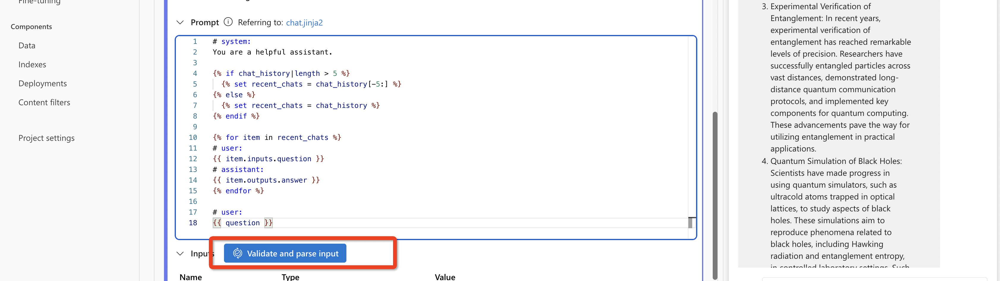

# 1.3.2 Create a Basic Flow with LLM tool
In this section we will build a chatflow to demonstrate capabilities of PromptFlow on AI Studio...

Create a "Chat Flow' by cloning the standard Chat template. \
(Follow Section 1.2 for a step-by-step guidance.) 

Make sure there is a VM running under Project Settings. \
(If there isn't create a new VM.)
Then Choose the created VM with the default runtime under advanced settings, update LLM block details and try and confirm the flow is running. 

Click on the LLM chat block and inspect the code!

## What is JINJA?
Jinja is a templating engine that offers several benefits when used in Azure AI Studio to define prompts. It enables the dynamic generation of content that adapts to user interactions and preserves conversation context, which enhances the relevance and accuracy of responses. The reusability and modularity of templates aid in scaling and maintaining consistency across applications, while the clear separation of logic and presentation streamlines development. Moreover, Jinja's flexibility facilitates easy customization of prompts without modifying the underlying application logic, making it an effective tool for developing responsive, context-aware, and customizable AI-driven applications.

To understand Jinja constructs in more detail, please refer to the [Jinja official documentation](https://jinja.palletsprojects.com/en/3.1.x/)

## DAG STRUCTURE & INPUT / OUTPUT RELATIONSHIPS 

PromptFlow uses a DAG (Directed Acyclic Graph) structure.
Flow is "directed" meaning it flows in a certain direction. 
Each module (tool in PF terminology) takes its input from prior modules and its output can be taken as input by any other tool.

The flow is "acyclic" meaning it is not "cyclic", a closed curve. Ultimately it is a pipeline of finite set of steps taking an input and outputing a result.

Input and Output modules are static. 
Input designates the "user prompt" received in chat. \
Output is what the flow generates.

## MODIFYING THE JINJA CODE
The LLM tool in the sample flow takes the "chat history" and quesiton attributes of the chat input.

<pre><code>
# system:
You are a helpful assistant.


# user:
{{item.inputs.question}}
# assistant:
{{item.outputs.answer}}


# user:
{{question}}

</code></pre>

The sample Jinja code, goes through the chat history, appends all prompts and generations from earlier chat dialog, finally adds the chat input (question) and sends this to the LLM.

Now start chatting with the bot. \
After each answer from the chatbot check the output trace.

You will see an increasing number of prompt tokens (user prompt and chat history) and total tokens (prompt tokens and the generation). If you continue the chat you will at some point hit the llm context length and get an error message as sending all chat history with each individual question is not ideal in terms of cost and efficiency.

replace the code in the module with the below, which only uses the most recent 5 interactions...

<pre><code>
# system:
You are a helpful assistant.




# user:
{{ item.inputs.question }}
# assistant:
{{ item.outputs.answer }}


# user:
{{ question }}
</code></pre>

Copy the code and press "validate and parse input".

Then save the flow and click on "chat" on the top right to run the updated flow