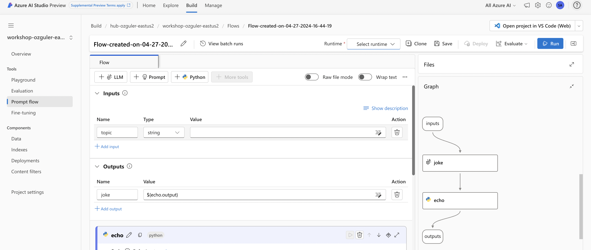
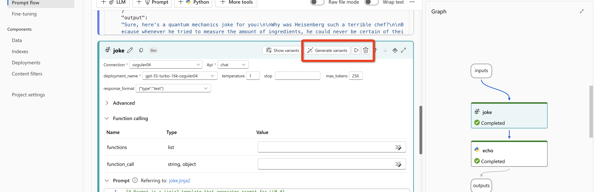
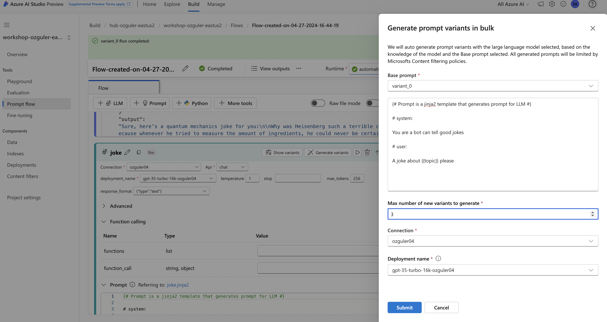
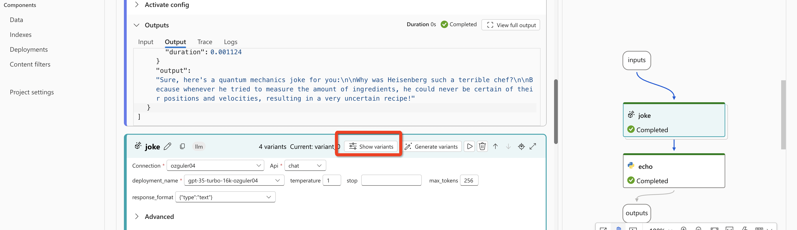
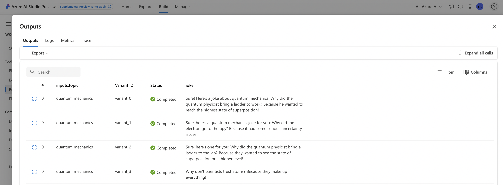
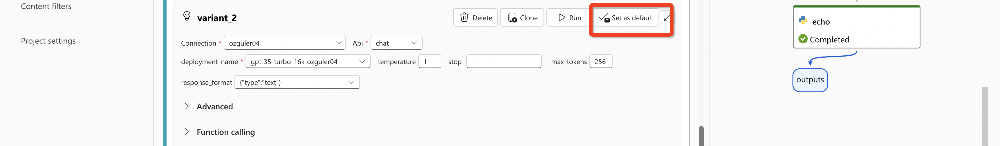

# 1.3.3 Prompt Tuning 

You can write your prompts in the LLM tool, which we already have seen on 1.3.2. \
LLM App Development is experimental in nature. \
The new hyperparameter to optimise is the "prompt". \
However running different prompts seperately takes too much time.
Prompt Tuning, is the capabilitiy to have multiple prompt variants and run them in parallel within a flow to find the best prompt version quicker.

In this lab, start with creating a standard flow from template. \
 
Fill in the connection details, choose the runtime with advanced settings and the active VM.

In this flow, LLM generates a joke based on the "topic" input from the user. Type in a "topic", save and run the flow.

Once the flow is executed see the output as below...
 

Next, let's generate prompt variants..
 

Confirm LLM settings and the base prompt you will use to generate variants. (max 5 variants are allowed currently).
 

LLM has now created prompt variants. You can have a look at each variant. Confirm how different each variant is. 
 

For each variant, you need to complete the  "validate and parse input" so that you are allowed to run the flow.

Save and run the flow for all variants. Once the flow run is completed see the generations from each variant via "view outputs".
 

If there is a particular variant output f which you liked more, you can make it your default prompt.
 

