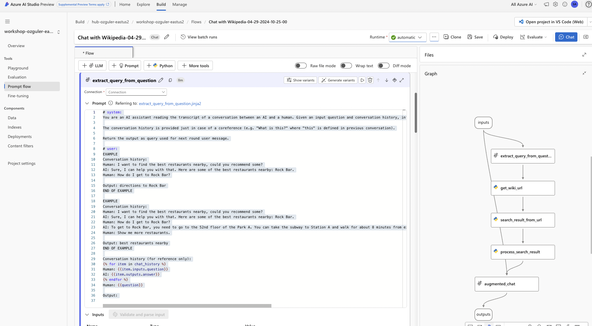
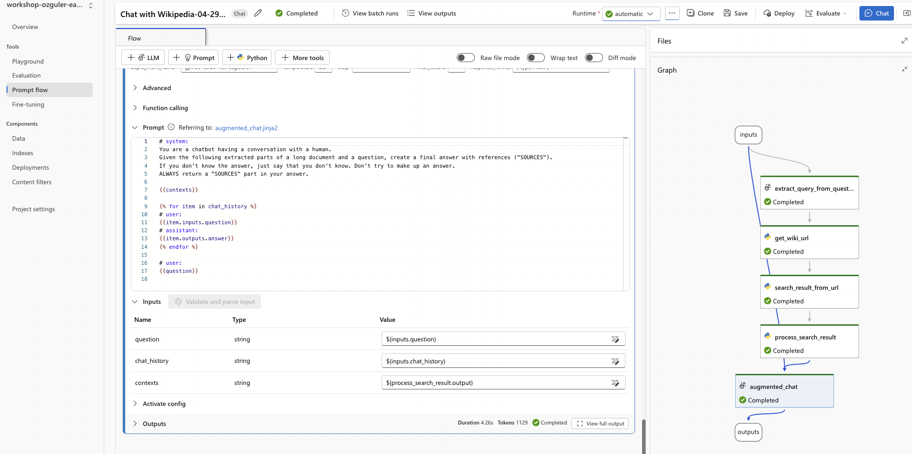
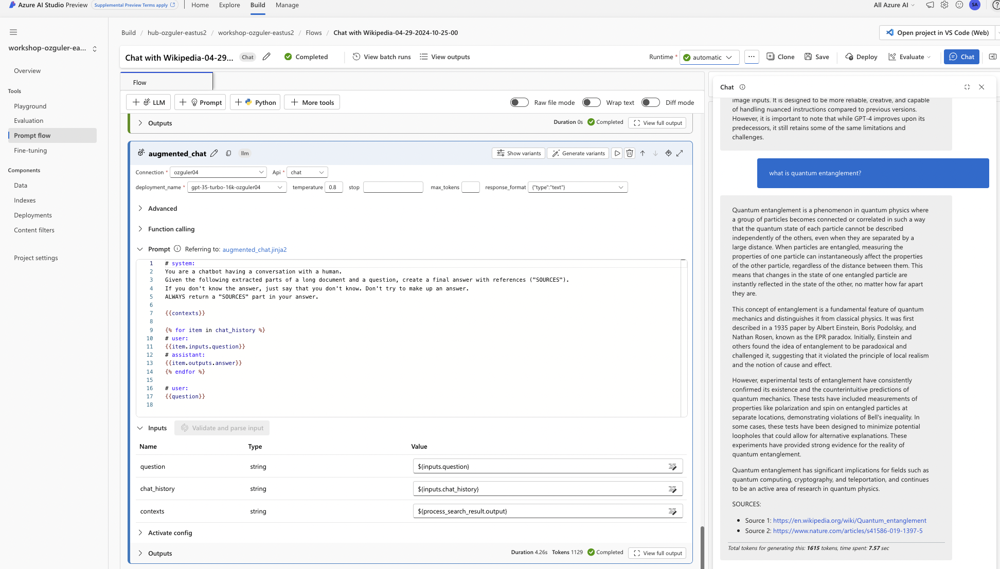
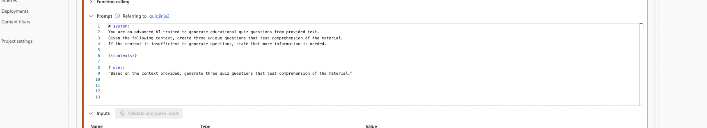
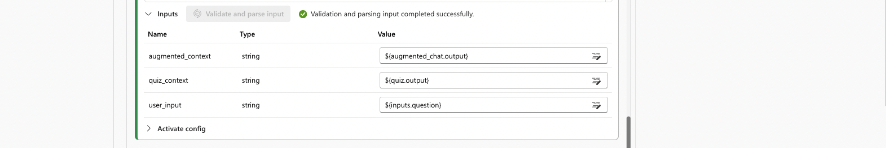
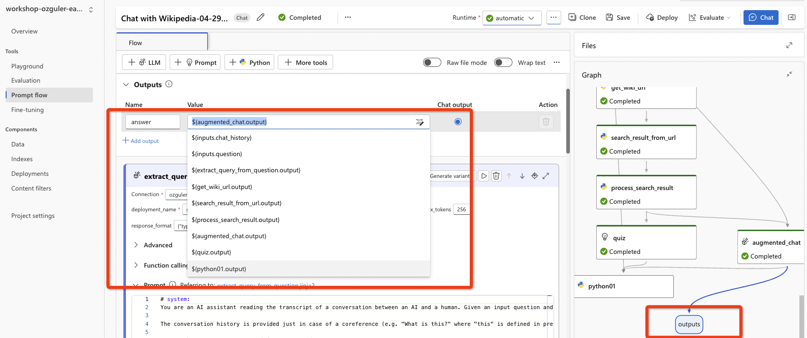
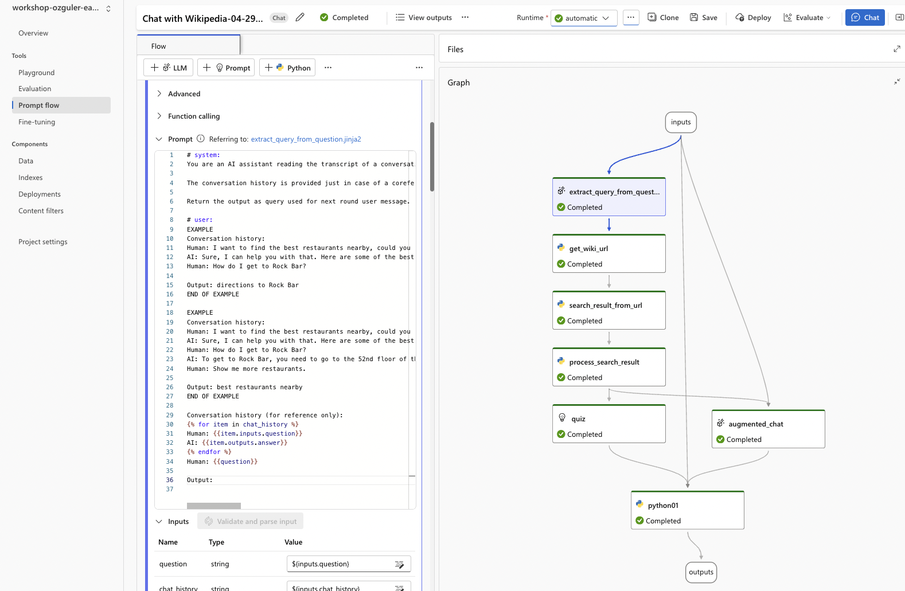
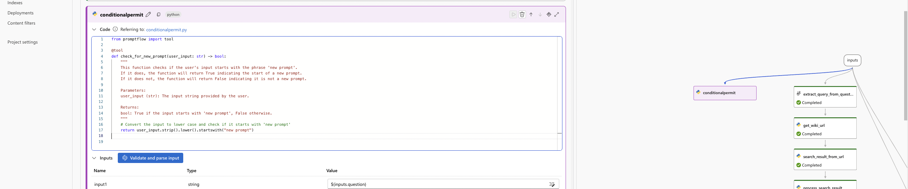
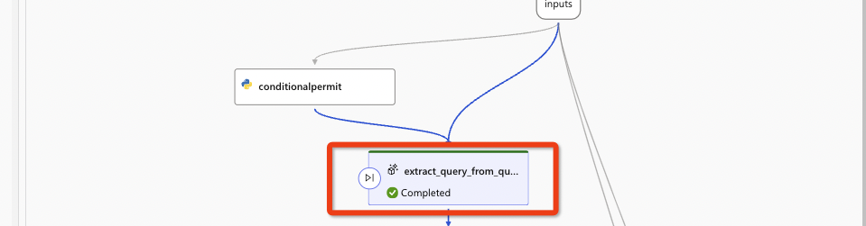

# CREATE A WIKIPEDIA CHAT APP 

In this module, we will crate a WikiPedia Chat App, where user can query any subject and the app will search the relevant wikipedia page / entry and answer to users questions. 

(As always first select the runtime. If the VM is not up, go to Project settings to start the VM. If a VM does not exist first create it.)

Below is the flow.

This is how the flow works.

**User Interaction:**
The user engages in a conversation with the AI assistant by asking questions or providing input.\
**Conversation History Analysis:**
The module analyzes the conversation history to understand the context of the current question. It considers previous exchanges to infer the user's intent accurately.\
**Intent Inference:**
Based on the user's question and the conversation history, the module infers the user's real intent. It identifies the key topic or action implied by the question. \
**Query Generation:**
Using the inferred intent, the module generates a query that encapsulates the essence of the user's request. This query serves as the basis for the next round of the conversation, guiding the AI assistant's response. \
**Output:**
The module returns the generated query, which is then used by subsequent modules in the app's workflow to provide relevant responses to the user's inquiries. 

Update LLM settings by specifying a AOAI connection and by choosing a model deployment) for the "extract query from question" and "augmented chat" tool steps. Choose "text" as the LLM output format. You can play with other model hyperparameters as you like!

Save and run the folow for any subject of your choice.

When successfully run, you will have green checkmarks for each flow step as below...

The output cites sources it generates the output from.

Inspect each module and its outputs step-by-step to understand how the flow works...

## CREATING QUIZ QUESTIONS 
Next we will generate a quiz out of the contents of the wikipedia search for each given subject by the user. 
Quiz bot will evaluate users answers and will provide further context for subjects covered in questions that are incorrectly answered.

Add an LLM step...

<pre><code>
# system:
You are an advanced AI trained to generate educational quiz questions from provided text.
Given the following context, create three unique questions that test comprehension of the material.
If the context is insufficient to generate questions, state that more information is needed.

{{contexts}}

# user:
"Based on the context provided, generate three quiz questions that test comprehension of the material."
</code></pre>

Click on "Validate and parse input"...
Assign ${augmented_chat.output} to the "context" as shown below.

## MERGING CONTEXTS with a PYTHON TOOL
Next add a "Python Tool" to combine contexts from "augmented_chat" and the "quiz" LLM tool modules.

<pre><code>
from promptflow import tool

@tool
def combine_contexts(augmented_context: str, quiz_context: str) -> str:
    """
    This function combines the contexts from augmented chat and quiz modules.

    Parameters:
    augmented_context (str): The context string from the augmented chat module.
    quiz_context (str): The context string from the quiz generator module.

    Returns:
    str: The combined context and a message prompting the user to answer.
    """
    # Combine the contexts from the augmented chat and the quiz generator modules.
    combined_context = f"{augmented_context}\n\n{quiz_context}"
    
    # Return the combined context with a message prompting the user to answer.
    response_prompt = (
        f"{combined_context}\n\n"
        "Please provide your answers to the above questions. "
        "You can write 'new prompt [your prompt]' to start over with a new topic. "
        "To give an answer, simply write 'answer to [question number]' followed by the answer."
    )
    
    return response_prompt
</code></pre>

Click on "Validate and parse input"...
Map inputs to previous module outputs as below.

Finally map the output of the new module "python01" (in my case, use the name you have assigned to the python module during creation.) as the input for the "output" module.

You will see the quiz questions added to the output...

This is how the updated flow looks. 

## Add a "Conditional Activation" module 
Now we will add a Conditional Activation module for the sake of demonstration. \
Only When the user starts the prompt with "new prompt" app will accept and process the prompt with the flow.

Add a Python module named "conditionalpermit". \
The module will check if the user prompt starts with the string "new prompt". \
If it does, "extract_query_from_question" module will be run. \
If it doesn't we will add a new module to evaluate answers from the user for previously asked quiz questions.

<pre><code>
from promptflow import tool

@tool
def process_user_input(user_input: str) -> dict:
    """
    This function checks if the user's input starts with 'new prompt'.
    It returns a dictionary with the user's input and a condition check result.

    Parameters:
    user_input (str): The input string provided by the user.

    Returns:
    dict: A dictionary containing the original user input and a boolean indicating
          whether it starts with 'new prompt'.
    """
    # Check if the input starts with 'new prompt'
    is_new_prompt = user_input.strip().lower().startswith("new prompt")
    
    # Return both the user's original input and the result of the new prompt check
    return is_new_prompt
</code></pre>

"Validate and Parse input". \
Then choose the input as "$(inputs.question) since we want to detect weather use is asking about a new subject by starting the prompt with "new prompt" or if this is an answer to quiz quesitons.

Now go to "extract_query_from_question" module.

Now we will add a condition to the "extract_query_from_question" LLM tool module.\
Under Activate config set "When" as ${conditionalpermit.output}, and as "bool" is "True". 
We want the "extract_query_from_question" LLM tool module only be executed if the user initiates a new prompt. 

Notice the one-way diode appearing on the LLM tool module. This denotes the module is tied to a condition.

