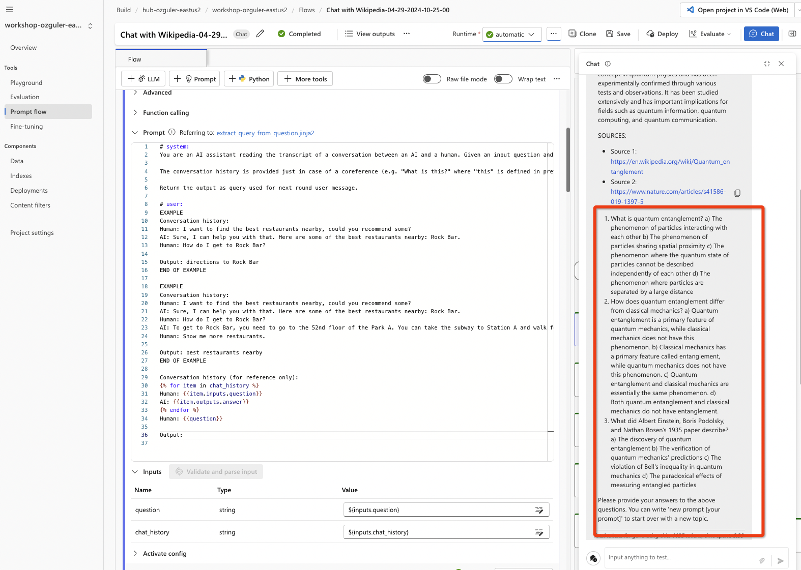

# CREATE A WIKIPEDIA CHAT APP 

In this module, we will crate a WikiPedia Chat App, where user can query any subject and the app will search the relevant wikipedia page / entry and answer to users questions. 

(As always first select the runtime. If the VM is not up, go to Project settings to start the VM. If a VM does not exist first create it.)

Below is the flow.

This is how the flow works.

**User Interaction:**
The user engages in a conversation with the AI assistant by asking questions or providing input.\
**Conversation History Analysis:**
The module analyzes the conversation history to understand the context of the current question. It considers previous exchanges to infer the user's intent accurately.\
**Intent Inference:**
Based on the user's question and the conversation history, the module infers the user's real intent. It identifies the key topic or action implied by the question. \
**Query Generation:**
Using the inferred intent, the module generates a query that encapsulates the essence of the user's request. This query serves as the basis for the next round of the conversation, guiding the AI assistant's response. \
**Output:**
The module returns the generated query, which is then used by subsequent modules in the app's workflow to provide relevant responses to the user's inquiries. 

Update LLM settings by specifying a AOAI connection and by choosing a model deployment) for the "extract query from question" and "augmented chat" tool steps. Choose "text" as the LLM output format. You can play with other model hyperparameters as you like!

Save and run the folow for any subject of your choice.

When successfully run, you will have green checkmarks for each flow step as below...

The output cites sources it generates the output from.

Inspect each module and its outputs step-by-step to understand how the flow works...

## Creating a quiz bot 
Next we will generate a quiz out of the contents of the wikipedia search for each given subject by the user. 
Quiz bot will evaluate users answers and will provide further context for subjects covered in questions that are incorrectly answered.

Add an LLM step...

<pre><code>
# system:
You are an advanced AI trained to generate educational quiz questions from provided text.
Given the following context, create three unique questions that test comprehension of the material.
If the context is insufficient to generate questions, state that more information is needed.

{{contexts}}

# user:
"Based on the context provided, generate three quiz questions that test comprehension of the material."
</code></pre>

Click on "Validate and parse input"...
Assign $(process_search_result.output) to the "context" as shown below.

Next add a "Python Tool" to combine contexts from "augmented_chat" and the "quiz" LLM tool modules.

<pre><code>
from promptflow import tool

@tool
def combine_contexts_and_interact(augmented_context: str, quiz_context: str, user_input: str) -> str:
    # Check if the user input indicates a desire to start a new prompt.
    if user_input.lower().startswith("new prompt"):
        # Extract the new user prompt from the input and reset the flow.
        new_user_prompt = user_input[len("new prompt "):]
        return f"New prompt received, resetting the flow. New user prompt: {new_user_prompt}"

    # Combine the contexts from the augmented chat and the quiz generator modules.
    combined_context = f"{augmented_context}\n\n{quiz_context}"
    
    # Here we would normally ask for user's answers to the questions posed in the quiz context.
    # Since this is an example, we will just return the combined context and a message prompting the user to answer.
    response_prompt = (
        f"{combined_context}\n\n"
        "Please provide your answers to the above questions. "
        "You can write 'new prompt [your prompt]' to start over with a new topic."
    )
    
    return response_prompt
</code></pre>

Click on "Validate and parse input"...
Map inputs to previous module outputs as below.

Finally map the output of the new module "python01" (in my case, use the name you have assigned to the python module during creation.) as the input for the "output" module.

You will see the quiz questions added to the output...

This is how the updated flow looks. 

