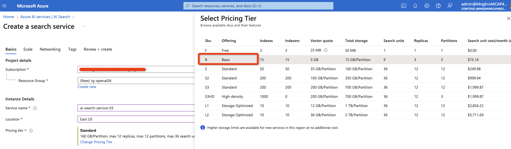
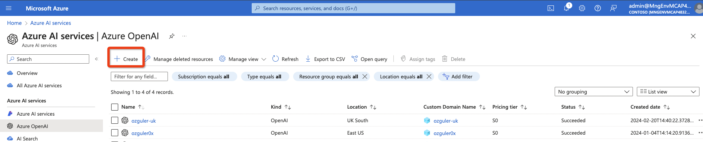
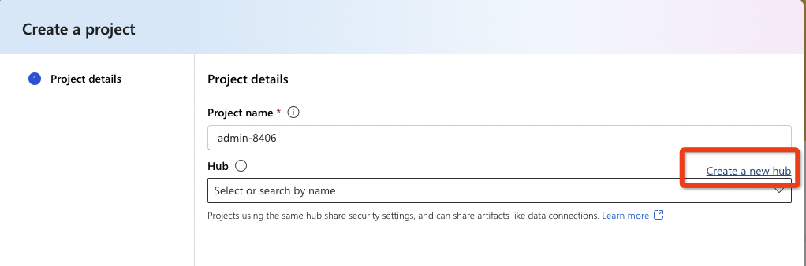

# Lab1 - Create a WikiPedia Chat Flow 

We will use the WikiPedia Chat Flow as a template to get upto speed with the basic functionalities and concepts in PromptFlow...
Open AI studio via https://ai.azure.com \
(Please note the "warning" at top left,  "Azure AI Studio is currently in Preview".)

## 1.1 Create a new Azure AI Studio Project 

Creating a new "AI Studio Project" in a new and dedicated AI Search service hub is recommended to rule out any problems with previous deployments.

The Azure AI hub resource is the top-level Azure resource for AI Studio and provides the working environment for a team to build and manage AI applications. In Azure, resources enable access to Azure services for individuals and teams. Resources also provide a container for billing, security configuration and monitoring. (See [Azure AI Resources documentation](https://learn.microsoft.com/en-us/azure/ai-studio/concepts/ai-resources) for more...) 

If you already have a running Azure AI Search service instance and an AzureOpenAI endpoint, AI Studio will automatically recognise them during service hub creation. If you don't have these services created beforehand create them as below before creating your Azure AI Studio Hub / Project.

### 1.1.1 Create a new Azure AI Search Service 
Create a new resource-group. \
Free or Basic tiers will suffice for the purposes of this lab.

Validate and create the service...

### 1.1.2 Launch a new Azure OpenAI Service Endpoint 

Validate and create the service...

### 1.1.3 Create Azure AI Studio Service Hub resource and a new AI Studio Project

Validate and create the service...