 

# Welcome...

Welcome to Azure ML PromptFlow workshop. \
In this workshop we will create a RAG based chatbot using PromptFlow.

# INTRODUCTION to PromptFlow 
Prompt flow is a suite of development tools designed to streamline the end-to-end development cycle of LLM-based AI applications, from ideation, prototyping, testing, evaluation to production deployment and monitoring. It makes prompt engineering much easier and enables you to build LLM apps with production quality.

With prompt flow, you will be able to:

- Create flows that link LLMs, prompts, Python code and other tools together in a executable workflow.
- Debug and iterate your flows, especially the interaction with LLMs with ease.
- Evaluate your flows, calculate quality and performance metrics with larger datasets.
- Integrate the testing and evaluation into your CI/CD system to ensure quality of your flow.
- Deploy your flows to the serving platform you choose or integrate into your app’s code base easily.
- (Optional but highly recommended) Collaborate with your team by leveraging the cloud version of Prompt flow in Azure AI.

For PromptFlow documentation please refer to [link](https://learn.microsoft.com/en-us/azure/machine-learning/prompt-flow/get-started-prompt-flow?view=azureml-api-2).

(PromptFlow was GA'ed on Nov 11th, 2023. Therefore you no longer need to enable it from under "preview features" in Azure ML))
Go to [ml.azure.com](https://ml.azure.com).

# 1. Create an AzureML Workspace for PromptFlow under AzureML
We need to create a workspace under AzureML for PromptFlow.
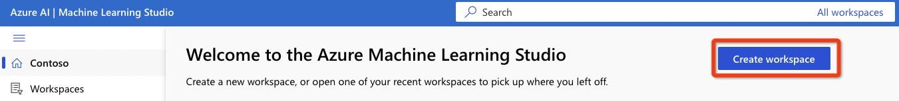 

Add workspace-name, resource-group and region details. (An existing resource-group can be reused) \
It will take <1 mins for the workspace to be created. \
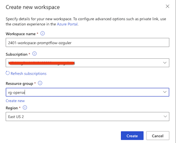

Once the workspace is created. Choose the workspace and click on PromptFlow on the left vertical menu.
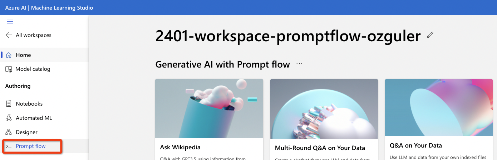

# 2. Create required AOAI Deployments and corresponding PromptFlow connections 

PromptFlow uses "connections" to interact with the larger service infrastructure. \
We need to create seperate connections for LLM's weather these are AzureOpenAI models, OS or other external models, registered vector indexes and vector db's  or custom connections for any other 3rd party API's.

For a RAG chatbot - we will need...
- embedding models to embed document chunks 
- a vector index so that document embeddings can be stored to generate relevant and correct contexts for chat queries 
- LLM's to understand the submitted context and respond to chat questions 

Next we will create model deployments and the required PromptFlow connections to be able to use these models for the RAG pipeline.

## 2.1 Create AOAI service and model deployments in AOAI Studio
Go to portal.azure.com, and choose "Azure AI Services"...
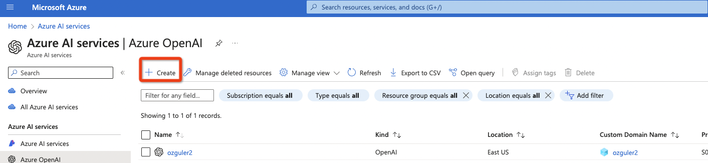

Next type the service name, the rg and make the service accessible over the Internet. Wait until the service is successfully deployed.
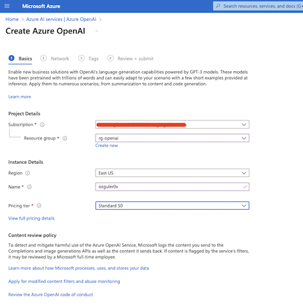

Before we proceed with deploying the models, let's note down service endpoint and API key. (We will need these to create the PromptFlow connection for the created service.)
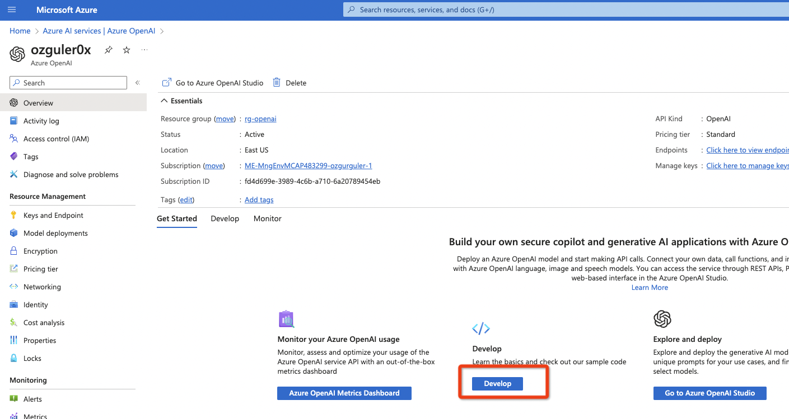

Then go to Azure OpenAI Studio to deploy the required models under the service.
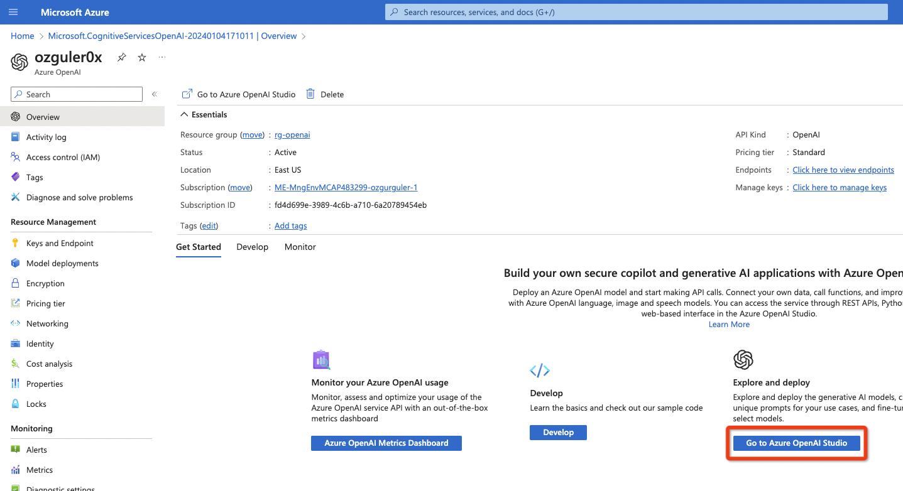

Once in Azure OpenAI Studio, choose deployments in the left vertical menu and create new deployments.
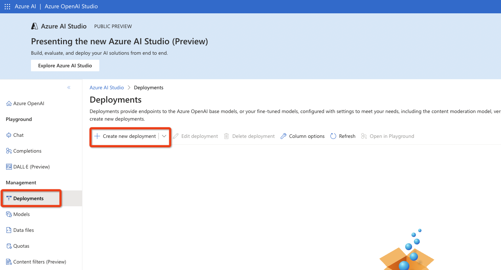

First deploy the text-embedding-ada-02 model.
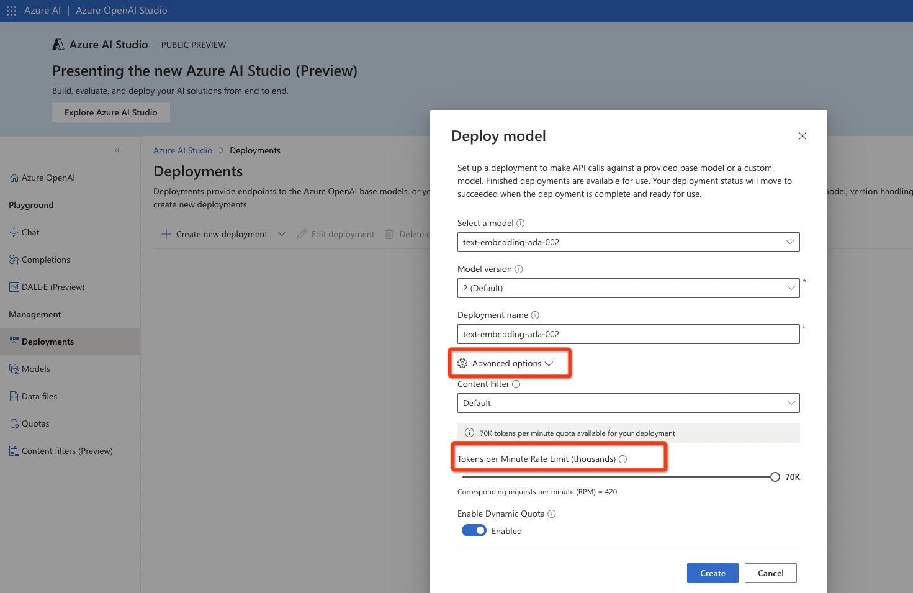

Next deploy the LLM that will be used to drive the chat.
(Prefer a larger context length variant such as gpt-35-turbo 16k as the derived context might be larger than the default 4k tokens of gpt-35-turbo. 
If the model exists in your deployment region prefer the latest variant such as gpt-35-turbu 1106.)
Refer to "[AzureOpenAI model list and region avaialability](https://learn.microsoft.com/en-us/azure/ai-services/openai/concepts/models)" documentation.
Refer to "[AzureOpenAI model quotas](https://learn.microsoft.com/en-us/azure/ai-services/openai/quotas-limits)" documentation to understand how much TPM you can allocate to deployments.

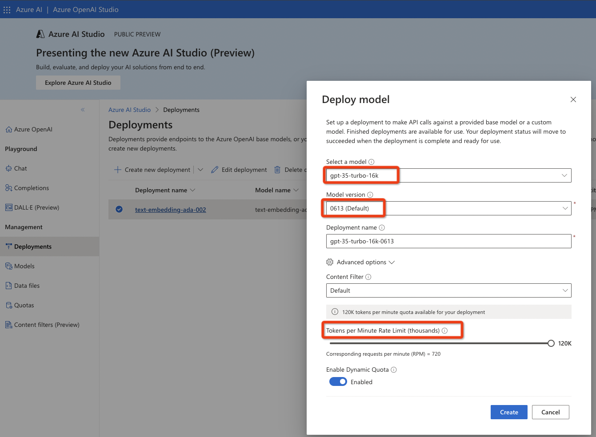

Once the models (ada-embedding-02 and gpt-35-turbo-16k) are deployed we can proceed to create a connection under PromptFlow for the "AzureOpenAI service".
When defined, PromptFlow will be able to access the deployments over the AOAI connection. (You don't define connections per each deployed model but only for the service itself.)

## 2.2 Create a connection for the AOAI service in PromptFlow  
Once back in PromptFlow workspace, choose connections and create a new connection.
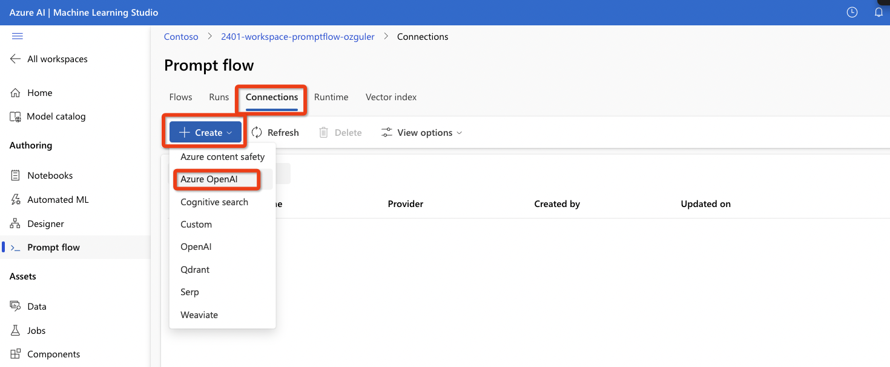

Once the subscription ID is chosen, you will automatically see any AOAI service deployment names being pulled.
Choose the one created in the earlier step.

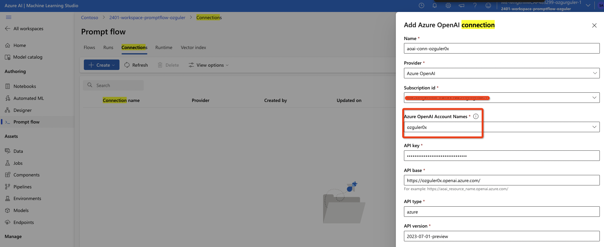
This completes the AOAI conn creation step.

# 3. Azure AI Search - PromptFlow Integration 
## 3.1 Create an Azure AI Search Service
Within a RAG flow, vector embeddings for document chunks are created with text-embedding-ada-02 model.
The embeddings needs to be stored and indexed so that we can run the ANN search algorithm to find relevant document chunks to create the context to answer a chat query.
PromptFlow offers multiple options here. \
PromptFlow can automate the RAG flow with "Index Creation" capability. With this a RAG AzureML Pipeline is created and executed automatically. During the Index Creation, document chunk embeddings are stored as a registered index in PromptFlow and stored in Azure AI Search through the PromptFlow AzureAI Search connection. 

We now need to create an AI search service to keep the vector index for embedddings and create n Azure AI Search connection in PromptFlow. 

Go to Azure portal and search "Azure AI Search" service (Former Azure Cognitive Search).
Once you are in Azure AI Search, create a new service
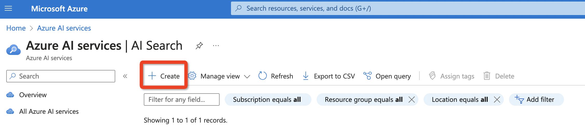

Choose a resource-group (create a new one if doesn't exist). \
"Basic" or "Free" tier will suffice for the purposes of this lab.
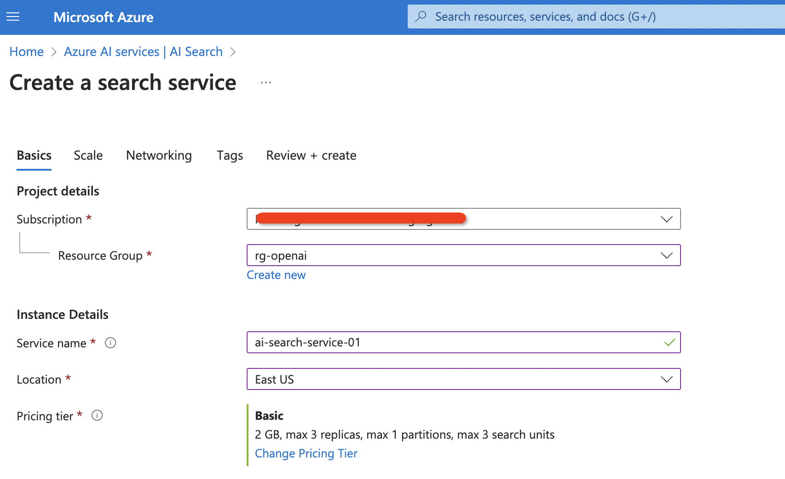

While on the AI Search portal page, click on "keys" from the menu on the left. Copy the API key.
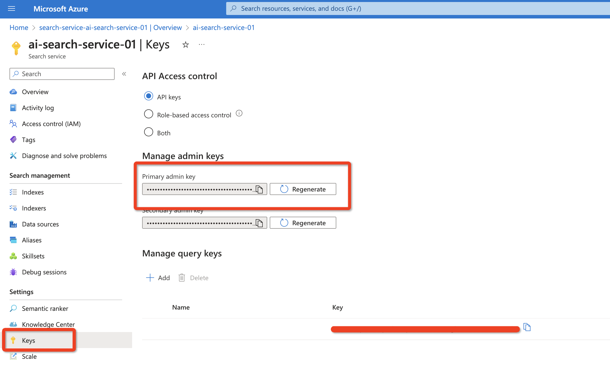

## 3.2 Create a PromptFlow connection for Azure AI Search service 
PromptFlow uses "connections" to access vector indexes, vector db's, LLM's (both AzureOpenAI, models deployed through model catalog or external models from other vendors), embeddings models and other Azure services such as Azure Content Safety and Azure Cognitive Services.

PromptFlow will need to access to the "AI Search" service to initially create the vector index for document embeddings. It will then use the same connection to search the vector index for finding relevant document parts and creating the context for a given prompt.

To create the connection for the Azure AI Search service...
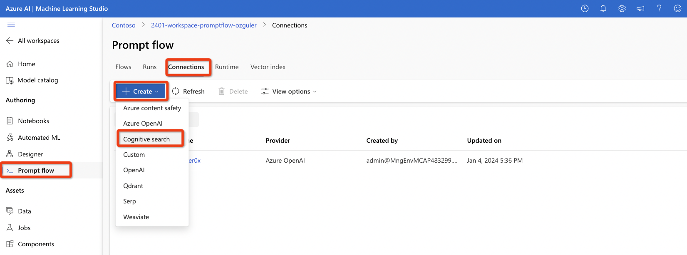

Type in the required details...
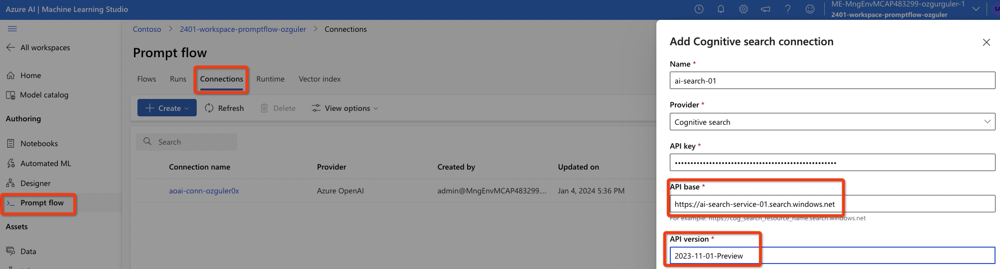

API version 2023-07-01-Preview was the first API version that had vectorstore capability. 
The latest API's has new capabilities documented [here](https://learn.microsoft.com/en-us/azure/search/vector-search-how-to-create-index?tabs=rest-add-config%2Crest-2023-11-01%2Cpush%2Cportal-check-index). Make sure API version correctly reflects an API with capabilities you would need. \
**For the purposes of this demo, please use 2023-07-01-Preview as your API version.**

With that we will now have the two required connections for vector index creation...
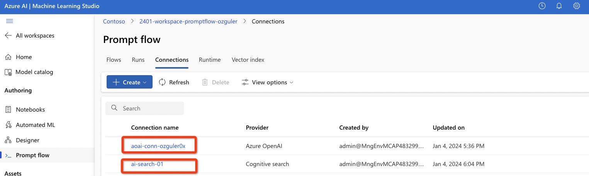

# 4 RAG Automation through Vector Index Creation

Next, create a new Vector Index...
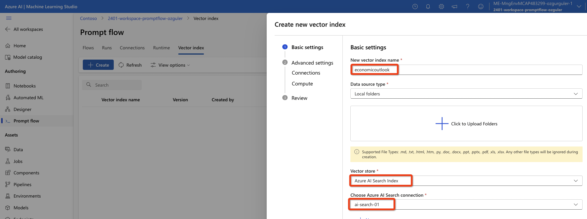

Fill in the details such as vector index name and make sure the correct AI Search service connection is chosen.
(_While typing in the name make sure it is only letters without any special characters such as a hyphen or underscore._)

Download and put the "IMF-world-economic-outlook-oct23.pdf" document in a local folder and uplaod this folder which we will use for our testing.

In the next screen, choose the AOAI connection we have created in earlier steps.
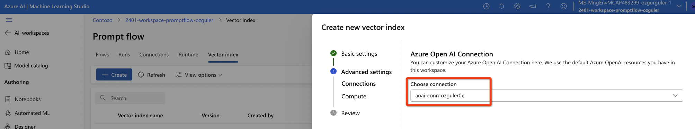

We need a compute resource to execute the RAG pipelien required for Vector Index creation. \
You can choose an existing compute instance or an AzureML compute instance /cluster for the task. \
If none exists create a new instance, choose an instance type from within options presented earlier.
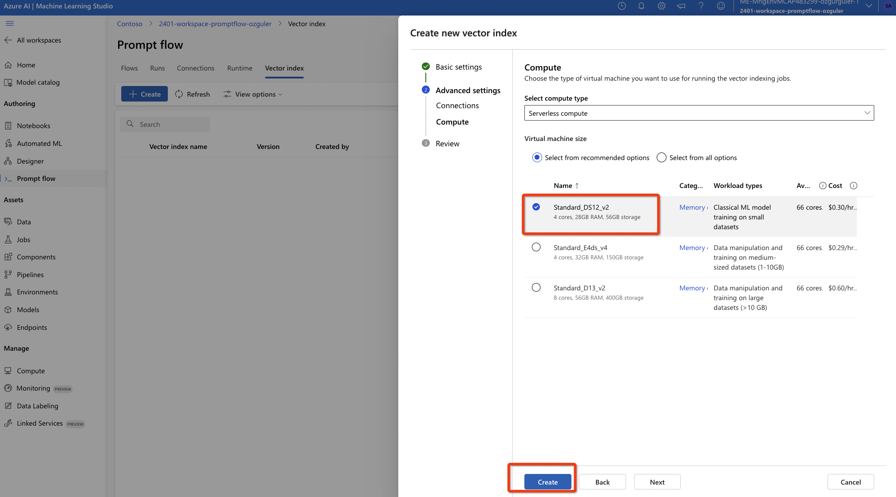

Once the compute cluster is launched, click on the "Job Details" to follow the pipeline execution. \
The execution may take as long as 15-20 minutes. 
Please consider taking a break at this point.
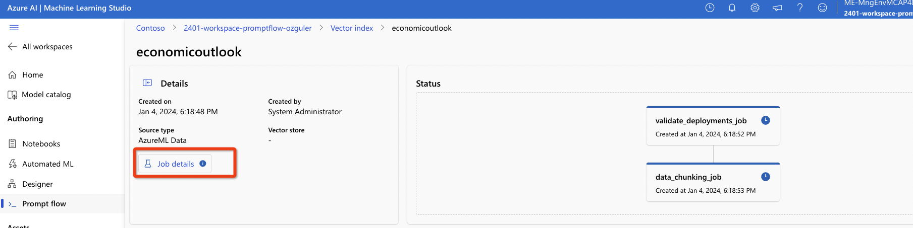

Pipeline will be executed step-by-step. You can watch the progress in this screen.
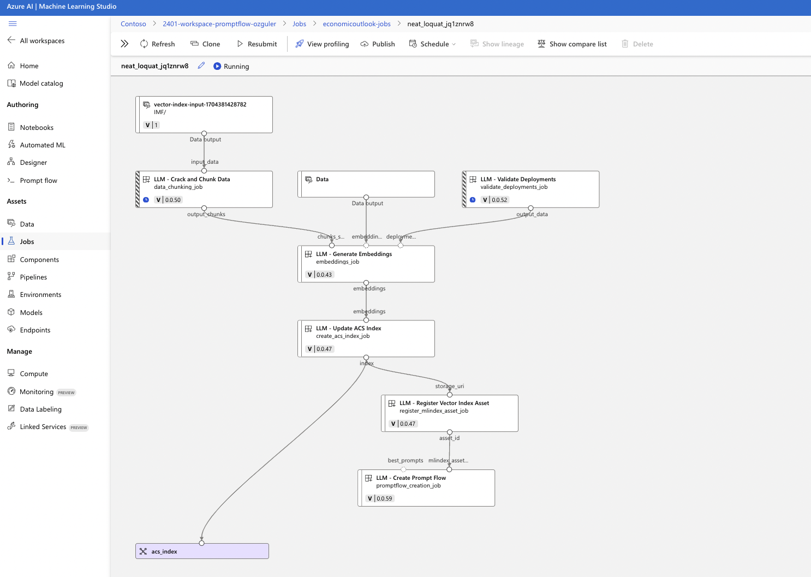

You can check the execution logs while the pipeline is progressing too. \
Click on "Job Overview" and "Outputs + logs" and choose "execution logs".

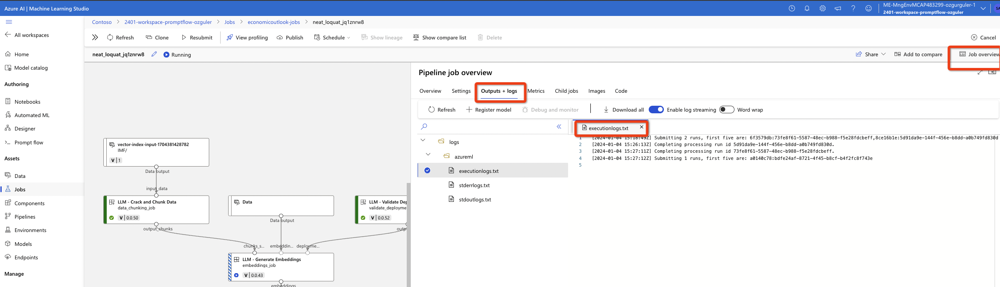

Once completed, you will see each step colored as "green". 
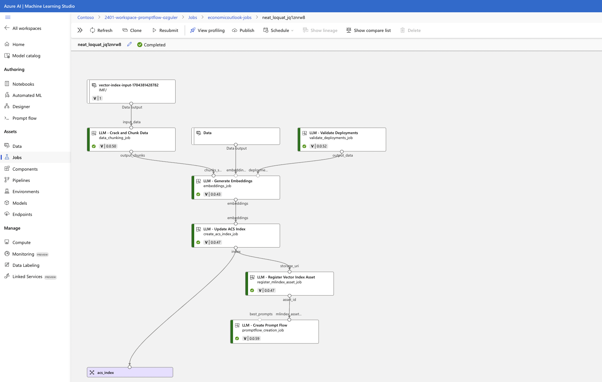

Now go back to the previous "vector index" creation screen and choose "Example Prompt Flow".
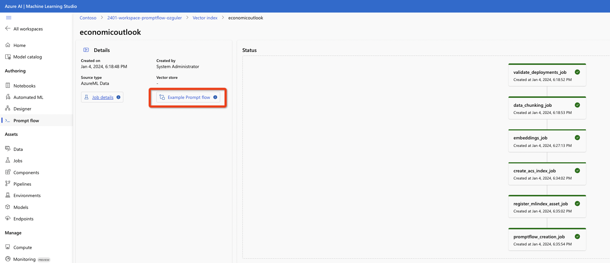

A Q&A Chat flow will be automatically created as seen below...
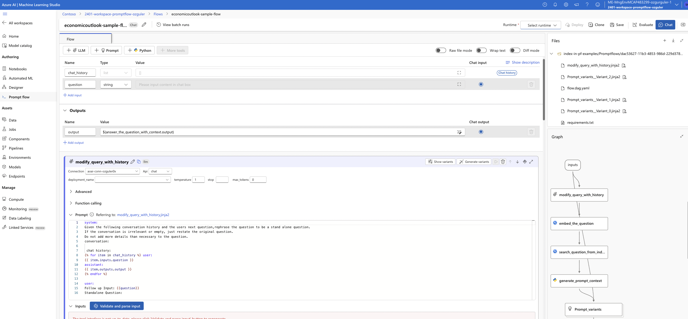

If your previously created AOAI connection is working, the "LLM Blocks" will be automatically populated with the previously deployed gpt-35-turbo-16k 0613 model. \
Activate the pull down menu and choose the LLM models for embeddings and chat.
Configure max_token parameter for LLM's to a high value e.g. 10000 to make sure your context + prompt size will not hit that threshold to avoid an error.

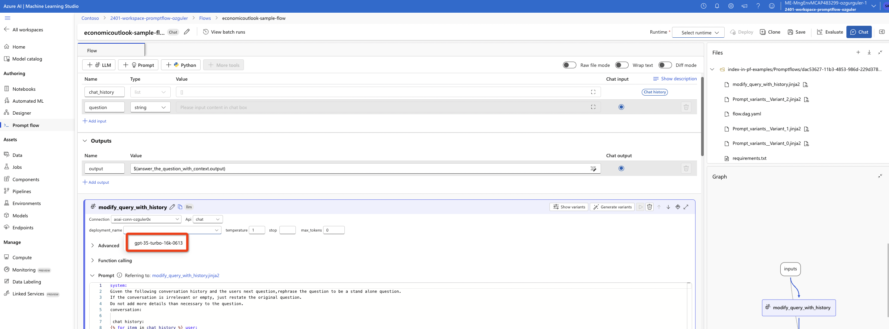

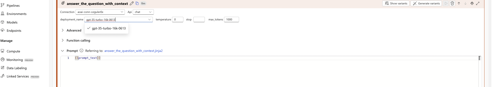

Once the LLM model deployments are configured, fix the blocks that complain with a warning message "The tool interface is not up-to-date, plebyase clicking 'Validate and parse input' button to regenerate."

Next launch the PromptFlow "runtime".  
Runtime in PromptFlow terminology is the Azure ML instance and the "docker image running on top of it. (The docker image which contains all software and runtime dependencies is named as an "Environment" in Azure ML. You can ssh in to the insance to deploy any required sw package which we will cover in a later lab.)
Once the instance is up and running we can proceed with the next step.

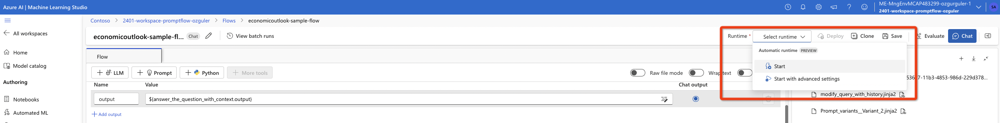

Hopefully your chatbot will be working if all the above are configured correctly...
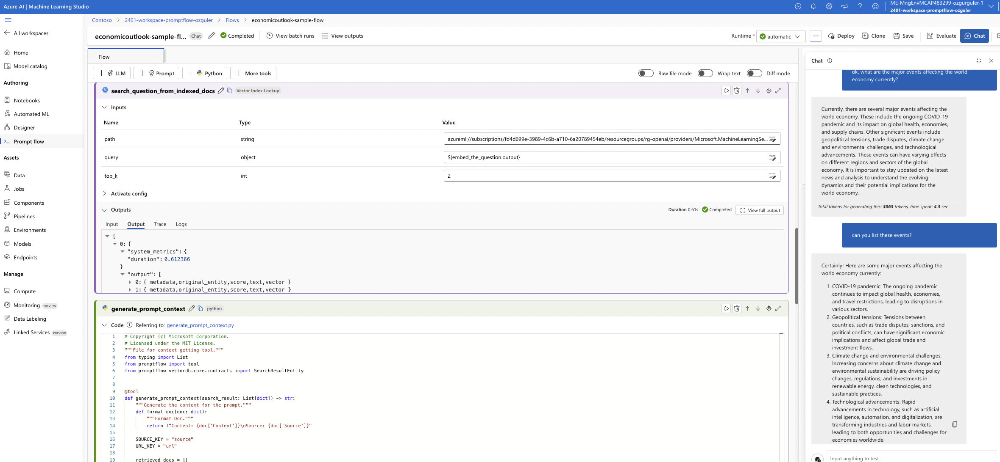

Don't forget to save your chat flow...
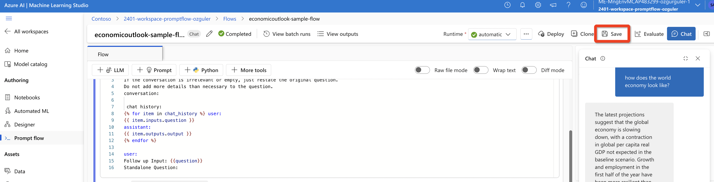

# 6 Improving the Chatbot 

## 6.1 Prompt Engineering 
### 6.1.1 Update the System Prompt  
LLM's perform better when asked to take on a persona. 
We will ask our LLM to behave like an chief economist from IMF. 

"You are an the chief economist of IMF with a PhD in Economics from Harvard University. You specialize in macroeconomic analysis, with extensive knowledge of global economic trends, policies, and data, particularly from IMF World Economic Reports. Your expertise includes understanding complex economic indicators, forecasting economic scenarios, and interpreting the impact of global events on economies. Provide nuanced, data-driven advice and guidance on macroeconomic questions, integrating the latest IMF reports and data. Your responses should be insightful, well-researched, and tailored to the specific economic context of the inquiry."

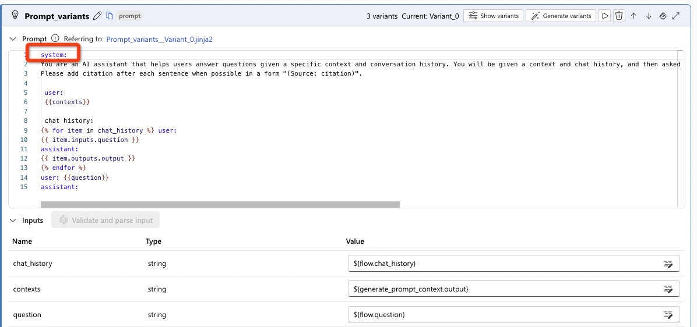

This systems prompt is created with GPT4, with a prompt asking the systems prompt to be improved by incorporating the latest research from LLM research.

Save the updated flow and run the chatbot again with the updated system prompt.

# 7. Troubleshooting 
If your chatbot doesn't work, make sure...
- The "runtime" has a green checkmark i.e. it is up and running.
- All required llm model selections are done correctly. 
- Connections have the right API keys and base URL's.
- Connections have 2023-07-01-Preview as their API version. 
- In LLM query blocks make sure max_token parameter is set to a high value such as 10000 tokens.

### Hope you enjoyed the content. 
### Please reach out for any feedback. 