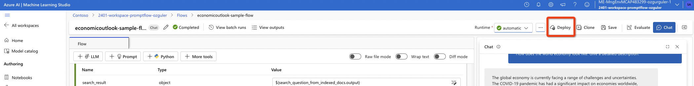
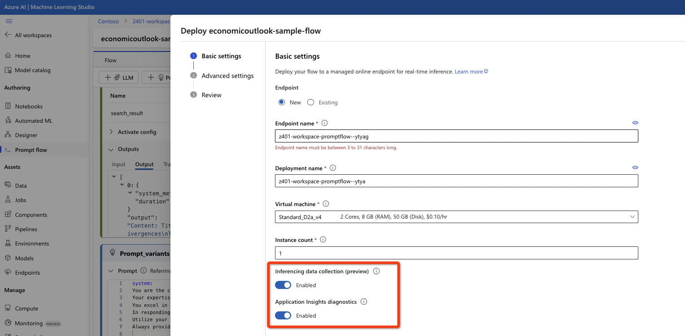
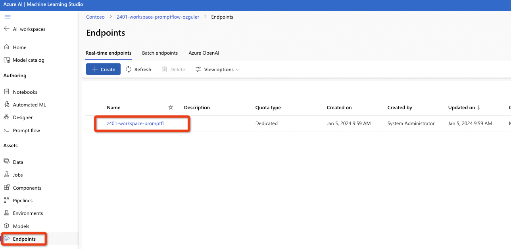

 

# Deploying & Monitoring your Chat App 

Once we have a working chat app we can start deploying it.
On the top right, find the "deploy" button.
 

Choose a compute instance and cluster node count...
Make sure "inferenceing data collection" and "application insights diagnostics" are enabled. It may take 1-2 minutes for the endpoint to be deployed.
 

The app will be deployed as a standard AzureML endpoint.
You can use the "Endpoints" in the left vertical menu to monitor deployment progress... 
 

Once the endpoint is up and running we can use it for queries or wrap it within a UI  (a frontend such as a React app running on Azure AppService).

