# 2.1 CREATING A VECTOR INDEX to AUGMENT GENERATIONS (a.k.a RAG)
In this lab we will first create a RAG application that integrates IMF's **"World Economic Report"** from April 2024, with a Chat UI.

- Create / Start your compute VM from under Project settings. \
- Download the World Economic Report from IMF from under Datasets and save it in a folder. *(Promptflow will not recognise individual files. You should be pointing out to a folder for upload to work.)*
- Create a new index, by choosing the "Indexes" tab from the vertical menu on the left of the screen.

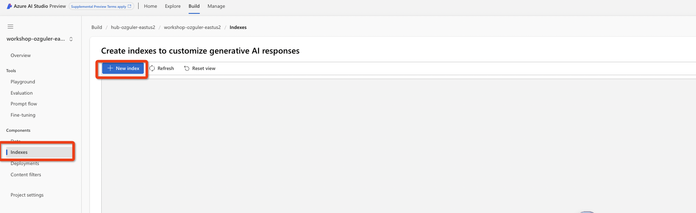

Choose "Upload Files" as your data source, choose the local folder that stored the IMF doc and click next.
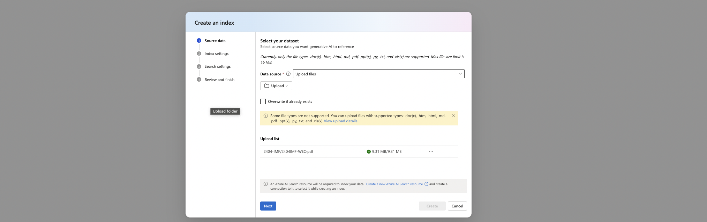

Next, if you have an up and running AI Search service within the same subscription where the AI Studio hub resource, it will appear as a selectable option in the "Select Azure AI service" tab. 

Name your index, make sure no alphanumberic characters, hyphen or underscore is used in the "name".
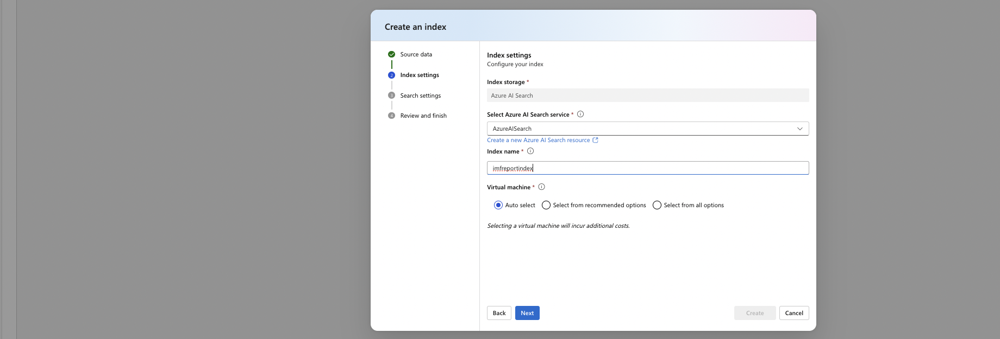

Next choose your AzureOpenAI service deployment. 
text-embedding-ada-002 (Version 2) embeddings model will be deployed to the service deployment if no embedding deployment exists already.
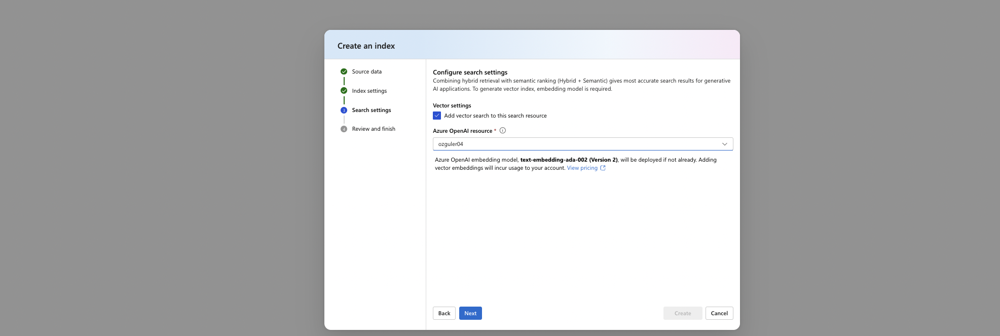

Finally, confirm the selections and start index creation...
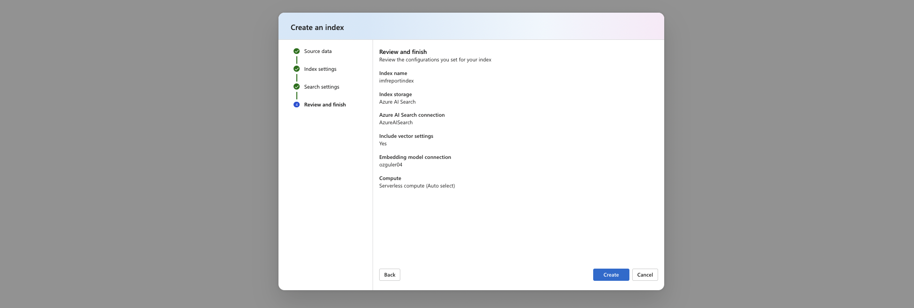

Once confirmed, a pipeline to create an index will be launched.
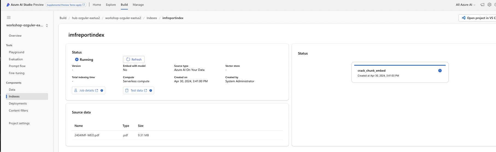

PromptFlow is built on Azure ML Designer. \
Click on "Job Details" to see the pipeline launched within [Azure ML Designer](https://azure.microsoft.com/en-us/products/machine-learning/designer/#product-overview) visible under AzureML/Jobs to carry out the cracking, chunking and embedding the document, as well as creating and updating an AI Search Index and registering the assets. As the pipeline steps are completed, they will appear in green in the job monitoring page.

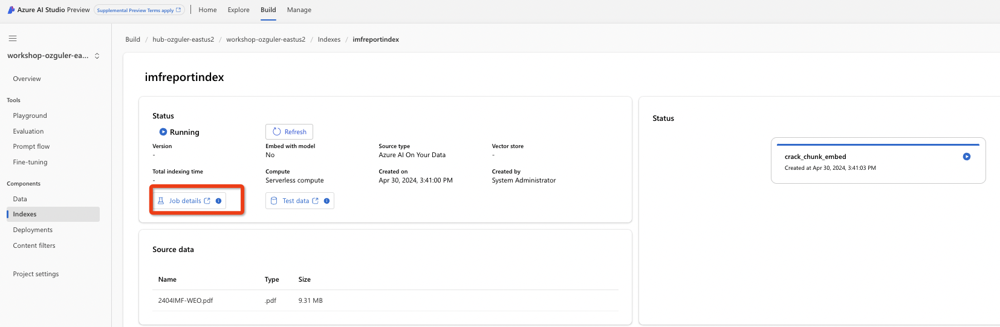

Azure ML pipeline being executed to create a vector index within Azure AI Search.
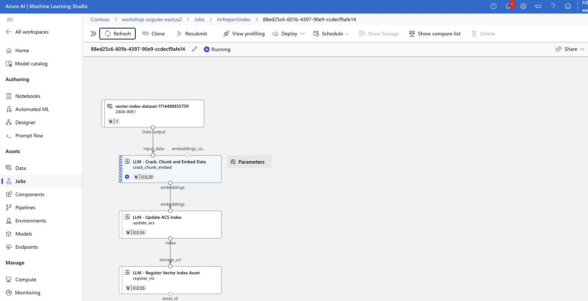

(It takes 10-15 minutes to create the index. May be a good time for a coffee break! You can follow progress of the pipeline by hitting "Refresh".)
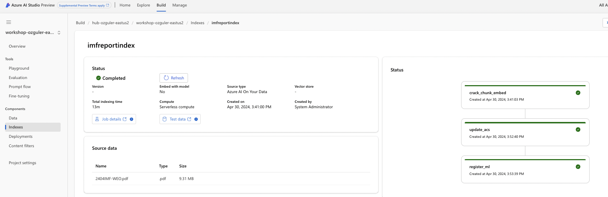

Confirm Vector Index creation, by going to Azure AI Search / indexes / imfreportindex. \
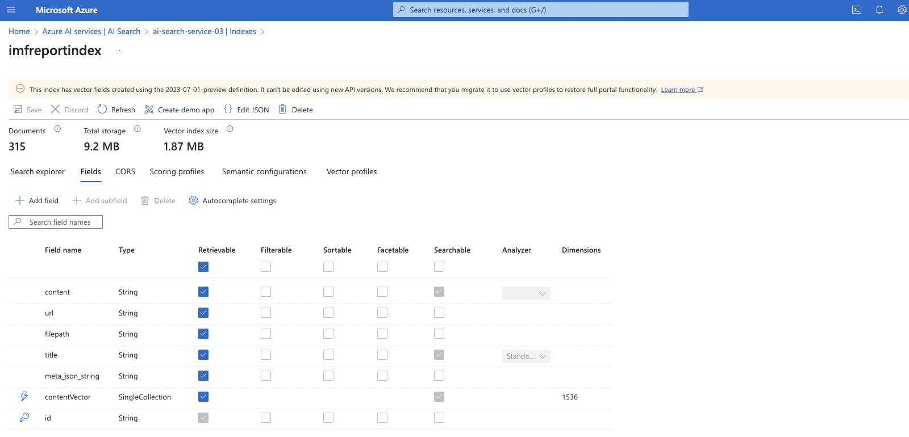

## CREATE A MULTI-ROUND CHAT FLOW 
Create a multi-round chat with your data flow by cloning the corresponding template. \
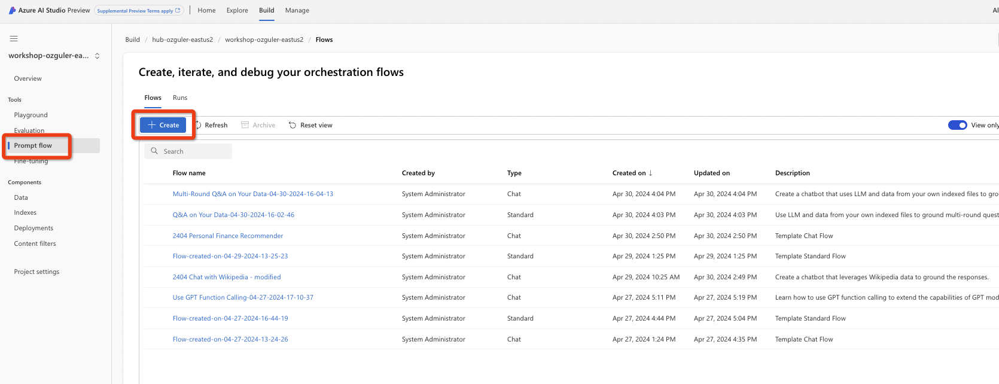

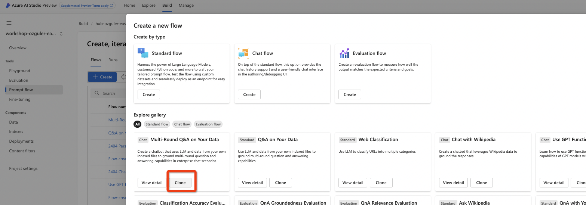

- Confirm you have a VM running from Project Settings. If the VM is down "Start" the VM. If a VM does not exist at all create it from under Project Settings choose "Create Compute".
- Attach a runtime to the flow by clicking on "Select Runtime", "Start with Advanced Settings", Select "Compute Instance" than your VM from previous step.
- Now, go over the flow DAG step by step. \
Flow consists of the following steps.

1. **LLM Tool - modify_query_with_history** This step is a query rewriting step, which takes into account the chat history and rephrases user input as a standalone question.

2. **[Index Lookup](https://learn.microsoft.com/en-us/azure/machine-learning/prompt-flow/tools-reference/index-lookup-tool?view=azureml-api-2) - step** This step takes modified query as its input and queries the specified search index (can be AI search or external), after taking the embedding of its input. (Index Lookup step automaticall takes the embedding of the query before sending it to the vectordb. This process previously required an addtional "embedding step")
3. **Python Tool** - The generate_prompt_context Python tool step turns the query results into a prompt context. Below is a detailed explanation.

The Python code defines a function that processes a list of search results, each represented as a dictionary, and formats them into a human-readable string. The function leverages a custom class, SearchResultEntity, to parse each dictionary and extract relevant data such as text content and source URL. These extracted details are then compiled into a structured format showing the content and source for each search result. The function is designed to work within a specific framework or library, as indicated by the @tool decorator, which suggests it integrates into a larger system for handling or manipulating search results. This setup is intended to facilitate easy viewing or further processing of the search results by presenting them in a clear, consistent textual format.

4. **Prompt Tool** - The Prompt tool gives more flexibility to the flow by introducing prompt variants.
5. **LLM Tool** - Finally we query our LLM of choice with the prompt which includes the context generated with vector/hybrid query results.

## CONFIGURE & UPDATE THE FLOW 
To complete the configuration of the flow we need to complete the following...
1. LLM Tool Steps 1,5 - Add AOAI connection and model deployment details. Set response format as "text" and "temperature" as 0.7.
2. Add the created vector index details to the "Index Lookup" Step.
Within the module click on ml_index content and choose index_type as "Registered Index" and mlindex_asset_id as the name you have assigned earlier to this index "imfreportindex".

Choose "queries" as the output of the prior step which is "modify_query_with_history.output".
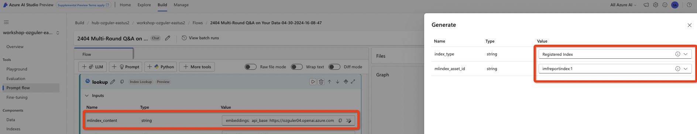

Save the flow and click on chat, type in a question that may be relevant to the IMF world economic report.
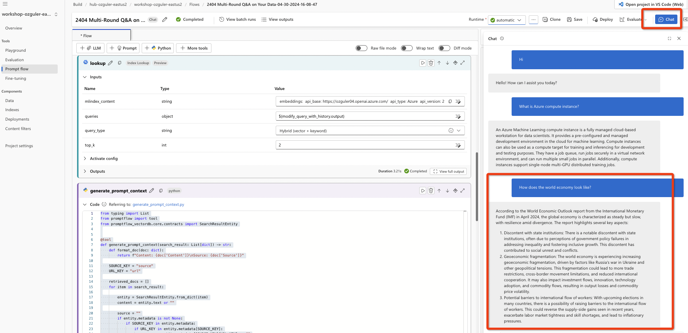

We have now sucessfully created the RAG app!