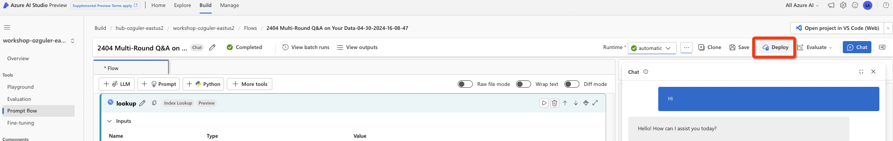
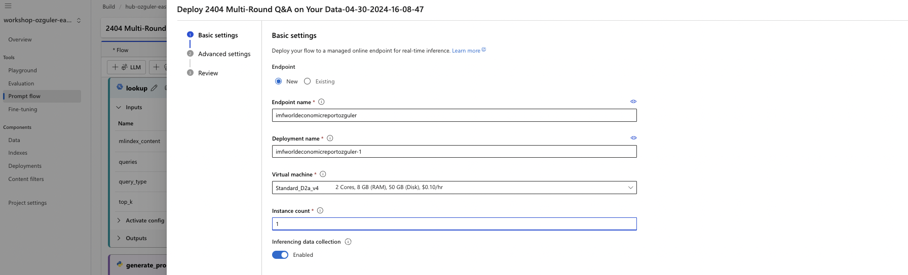
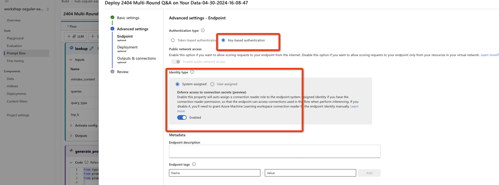
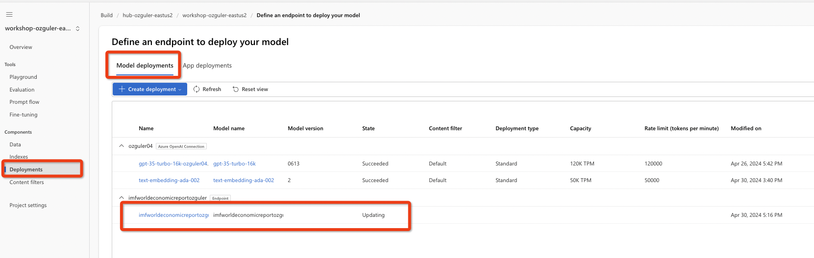
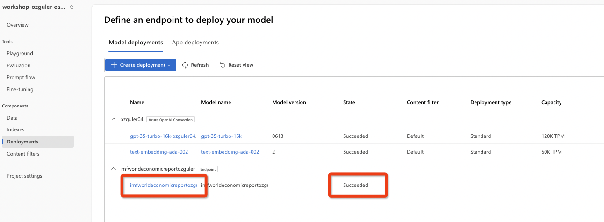
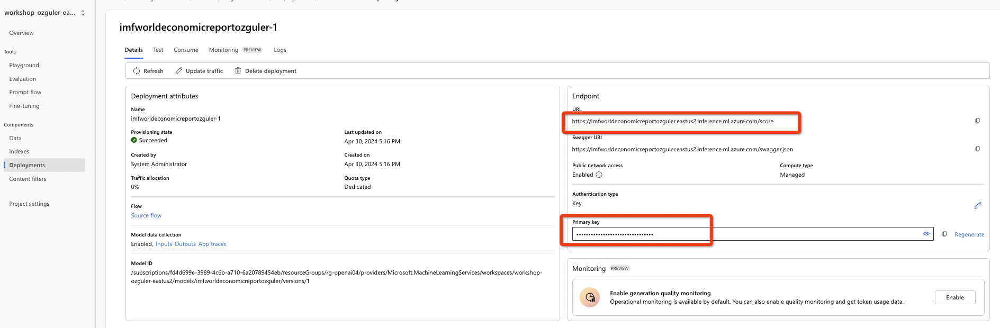
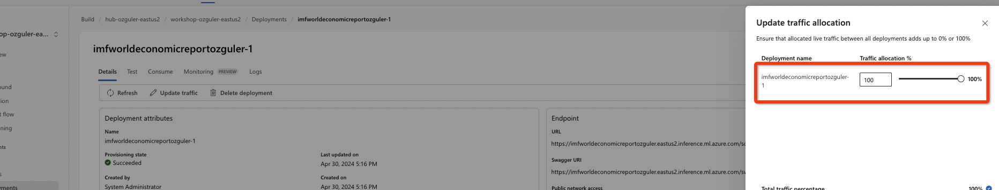

# 2.2 DEPLOYING the RAG APP 

Click on deploy on the top right.


Choose the compute cluster settings - instance type, count - to host the RTE - RealTimeEndpoint. \
(Leave inferencing data collection as enabled.)


Leave authentication as key-based and "Identity Type" as "System Assigned". \
Confirm the rest of the settings and click "Create".


The deployment will appear under "Deployments" that can be selected from the vertical menu on the left. \
Wait until the deployment 


Once deployment state turns to "Succeeded", click on the deployment name...


Copy the endpoint URL and password.



Next we will need to route traffic to the endpoint by assigning a "weight".


Route all incoming traffic to the endpoint by moving the slider to 100%. Click on update for the change to take effect.



Then send a query to the endpoint with a curl statement as below...
(Modify the bearer XXXXX with your endpoint password and the endpoint URL XXX as your endpoint URL. )
```
curl -X POST "XXX" \
     -H "Content-Type: application/json" \
     -H "Authorization: Bearer XXXXX" \
     -d '{"query":"how does the world economy look like?",
          "question": "how does the world economy look like?",
          "chat_history": "[]"
     }'
```


We confirmed the endpoint works. The endpoint can easily be wrapped within a UI/frontend which can be deployed as an app running on Azure AppService that may provide insights as to the current state of the economy.

