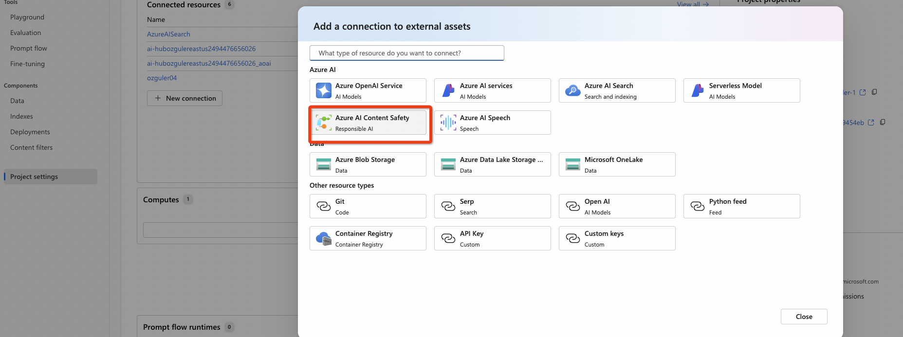

# Azure AI Content Safety 

The [Azure AI Content Safety service](https://learn.microsoft.com/en-us/azure/ai-services/content-safety/overview) is designed to help developers ensure that the content generated by their applications remains safe and appropriate. This service is particularly useful for applications that incorporate user-generated content or rely on AI models to generate content dynamically.

Here's a breakdown of what it typically offers:

Content Moderation: The service can automatically detect potentially offensive or risky content across text, images, and videos. It includes checks for profanity, adult content, hate speech, and other types of content that might not be suitable for all audiences.
Custom Rules and Filters: Developers can define custom moderation rules tailored to the specific needs and context of their application. This allows for greater control over what is considered acceptable in different scenarios.
Machine Learning Models: Leveraging Azure's machine learning capabilities, the service can be trained to recognize complex patterns and nuances in content that simpler rule-based systems might miss.
Integration and Scalability: As part of the Azure ecosystem, this service integrates well with other Azure services, allowing for scalable solutions that can handle large volumes of content.
Real-Time Processing: It provides real-time content analysis capabilities, making it suitable for applications that need immediate moderation decisions, such as live streaming platforms or instant messaging apps.
This service is a part of Azure's broader set of cognitive services, aimed at empowering developers to build AI-driven applications with built-in safeguards for content safety.

## Creating an Azure AI Content Safety Service through Azure Portal 
Find the service in the portal...

Choose "Create"...

Add service details, try to use the same resource-group as your AI Studio Hub resource to consolidate AI costs. Free tier will be fine for the purposes of this workshop.

[Optional] You can now go to Content Safety Studio and get familiar with the service.
## Content Safety Studio
[Azure AI Content Safety Studio](https://contentsafety.cognitive.azure.com/) is an online tool designed to handle potentially offensive, risky, or undesirable content using cutting-edge content moderation ML models. It provides templates and customized workflows, enabling users to choose and build their own content moderation system. Users can upload their own content or try it out with provided sample content.

## Adding the AI Content Safety service to AI Studio 
Go to your Azure AI Studio Project. \
Choose Project Settings and add a "**New Connection**" for the freshly created Azure AI Content Safety service.

From the pop up menu, choose "**Azure AI Content Safety**" service.

Choose the correct service instance and "API Key" as the authentication method. 

You no longer need to provide service endpoint URL and the service API key. \
Azure AI Search will automatically add the service as an available "tool" that can be added to existing flows.

Confirm that the services is added by checking "**View All**" and confirming the AI Content Safety Service...

## Create a multi-round Q&A on your Data Flow 
Now, let's go back to promptflow and clone "multi-round Q&A on your Data" chat flow template. \
Choose a runtime for the flow. (Make sure there is a up and running AI Studio VM instance, and then in the flow screen - Select Runtime / Start with Advanced Settings / Compute instance and then choose the compute instance running your flow.)

Populate the LLM details under the "modify_chat_with_history" and "chat_with_context" LLM step (the first and last tools in the flow) with the AzureOpenAI service and deployment (model). Change the temperature to 0.7. 

Next, fill in the ["**Lookup**"](https://learn.microsoft.com/en-us/azure/ai-studio/how-to/prompt-flow-tools/index-lookup-tool) tool  with the following...

Query type as "**vector** and leave top-k configuration as default 2.\
Save the flow and test it with a simple query...

## Confirm connection to Azure AI Content Safety Service
Go to Project settings and choose "view all" under connections.

Confirm the connection to the AI Content Safety service is listed in the connections list. (If not first go back to Azure Portal, configure a new AI Content Safety service endpoint and add the connection from under Project settings...)

## Using AI Content Safety within a flow 
Next, add a "Content Safety" tool, name it as contentsafety01.

Next, choose the connection to AI Content Safety Service, set all filters to "High Sensitivity" and since we want to filter user prompts, for text choose ${inputs.chat_input} as your input. 

Since we are filtering the generation, the output of the llm with the RAG context in this example, the "text" parameter of the contentsafety tool should be ${chat_with_context} step's output.

We want to display the output only if the generation passes through the filters...
To do that add a "Python tool". 

Add the following code this tool...
from promptflow import tool

<pre><code>
@tool
def process_suggested_action(input1: dict, input2: str) -> str:
    # Check if 'suggested_action' is 'Accept'
    if input1.get("suggested_action") == "Accept":
        return input2
    else:
        return "We cannot process this request."

# Example usage
# result = process_suggested_action({"suggested_action": "Accept"}, "Your request is processed.")
# print(result)
</code></pre>

Module will only display the generation if it passes through the content safety filter. \
If not it will display the following message. "We cannot process this request"

Run the flow for a sample prompt like "How does the world economy look like?".

Click on the "content safety" tool / module and check its output...

Please note AzureOpenAI's GPT models have inline filtering to detect and remove biases, aggressive and/or hazardous content and offline abuse detection models. Hence it is unlikely that AzureOpenAI GPT models will generate non-compliant outputs unless targeted by a successful detect e.g. jailbreak or prompt injection attacks. Hence AI content safety might be more valuable in filtering the generations of non-openai models and especially open weight models from other vendors or open source models. 

Now to force the model to generate an output that may trigger any of the filters, lets add another llm tool, which will take the output of the previous generation and generate a "provacative" joke from it and we will tie the content safety filter to the output of it.

Add the following prompt to the llm tool...
<pre><code>
system:
You are a provocative joke generator bot.

user:
Make a sexually provocative joke on this output {{output}}
</code></pre>

LLM tool will get the output of users question and make a joke about it. To make it hit the filter to trigger a reject we are trying to generate a sexual themed joke.

map the output to ${chat_with_context.output}.

In the content safety tool, make sure the "text" field is mapped to ${joke01.output}.

Now when you ask a question like "How the world economy looks like?" chatbot will generate a joke with the answer to the question. 
If you are lucky you will be able to trigger a reject in the filter.

In which case chatbot will respond with "we cannot process this request!".
