# 2.4 EVALUATION 

Evaluating generative AI applications is a critical step in ensuring quality and safety, as models like GPT-4 and LLaMA X hold great potential while also posing significant challenges. To navigate these challenges, Azure AI Studio offers a comprehensive suite of tools to assess your AI systems through a structured, iterative process. By starting with manual evaluations, developers can identify and prioritize specific risks and quality issues using small datasets. This initial step provides direct insight into potential biases, misinformation, or security vulnerabilities, allowing practitioners to iteratively refine prompts and apply targeted mitigation measures like content filters. Manual evaluation is particularly valuable for surfacing high-priority issues where ground truth is clear, laying the groundwork for a transition to scalable, automated testing.

Automated evaluation leverages traditional machine learning metrics and AI-assisted evaluations for a robust assessment at scale, enabling continuous quality monitoring as the system evolves. Traditional metrics provide quantitative measures when expected answers are known, while AI-assisted methods allow annotation of attributes such as relevance, coherence, and safety in scenarios where ground truth is unavailable. By simulating adversarial interactions and annotating outputs with GPT-4, Azure AI Studio can identify subtle security risks, measure jailbreak vulnerability, and track performance regressions. This dual-pronged approach provides a comprehensive view of system health, helping developers fine-tune applications with high precision and impact before full-scale deployment. Ultimately, a combination of manual and automated evaluation helps practitioners strike a balance between maximizing the benefits of generative AI while upholding responsible AI principles.

[Please refer to the Azure AI Studio documentation for more](https://learn.microsoft.com/en-us/azure/ai-studio/concepts/evaluation-approach-gen-ai
)...

## CREATING an Automated Evaluation Flow with AI Studio 
Get a multi-step chat flow up and running...
You can use the AI Search index for the IMF Economic Outlook document that was created in earlier steps. e.g. clone the sample flow, attach a runtime, update the LLM and IndexLookup steps. If the connections are in place tool parameters e.g. search index, connections and llm deployments will be explored automatically. 

Run the flow for a test run. The flow tool steps should all look green as in the picture below. Make sure you get a "relevant" response for your question. 
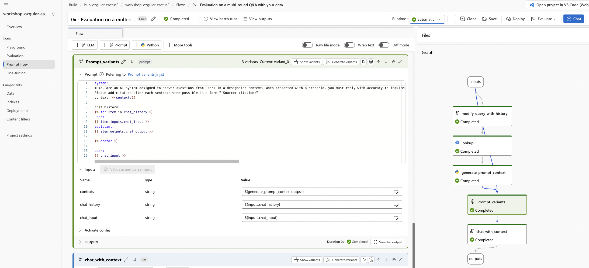

Evaluation can help with prompt engineering, by evaluating each "prompt variant" so that evaluation metrics for each variant can be compared to choose the best prompt variant. (To understand how "prompt variants" work, check the earlier section "Prompt Tuning" and the documentation ["Tune Prompts using Variants in Azure AI Studio"](https://learn.microsoft.com/en-us/azure/ai-studio/how-to/flow-tune-prompts-using-variants).)

Click on the 
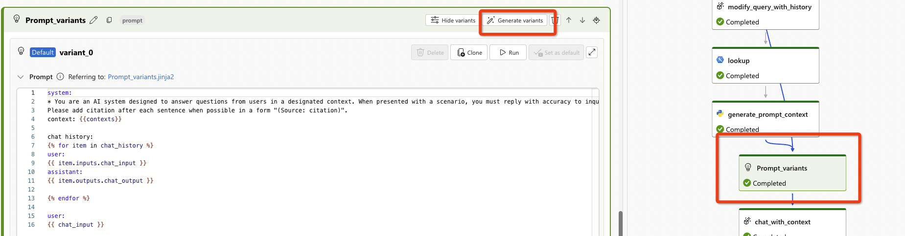

Choose an LLM, a base prompt and the number of variants you would like to generate. (Create <5, for the sake of demonstration only 2 variants so that eval runs do not take too long during the workshop. You will have the base prompt + the number of variants e.g. if you chose to create 2 variants you will have 3 prompts including the base prompt in total. You can then promote any of the prompt variants as your base prompt based on eval results and remove the rest if you like...)
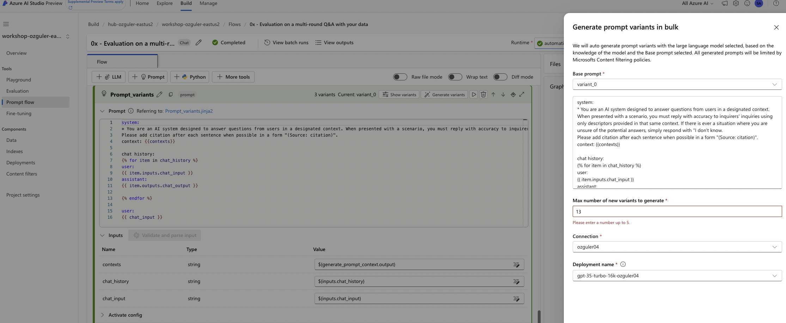

Run the flow to confirm all prompt variants work correctly. e.g. go to the variants tool step, choose "show variants" in the base prompt module, find variant_1, make it your base prompt and run the flow. Repeat for variant_2. This is to confirm the generated prompts are in line with the jinja formatted system/user/assistant prompt base. Otherwise during eval runs your prompts will not run. 
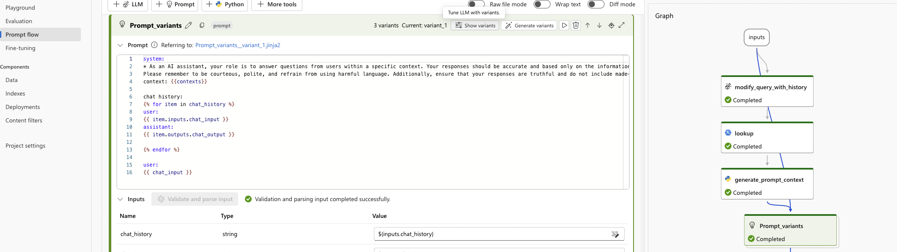
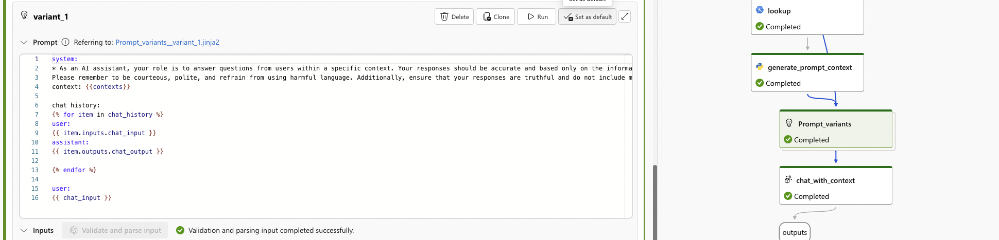

e.g.If you get the below error, set your base prompt as the default prompt, delete the variant and create it again. Keep iterating until you make sure all variants when promoted as the default prompt work without any problems...
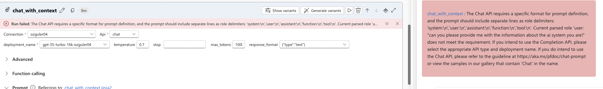
Save your flow and move onto the next step!

### Create and submit the Eval Flow 
Next, let's create an **"Evaluation Flow"** as in below...
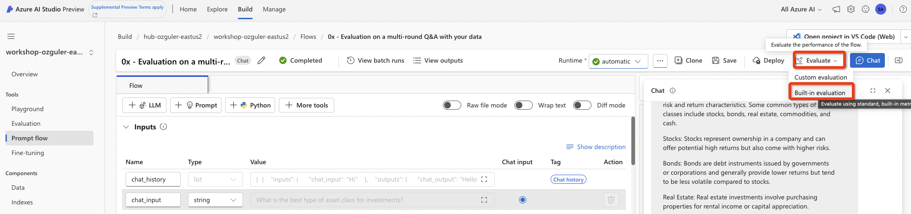

Choose an eval name, eval type, the variants you would like to evaluate as below...
We are evaluating a RAG flow so our scenario is "Conversation with context - Evaluate single-turn or multi-turn (with chat history) with retrieved documents".

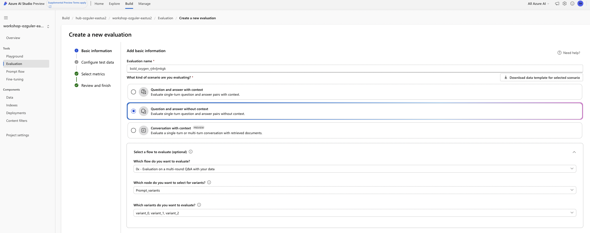

Next we will upload our eval data. \
Download the data under github repo / dataset. file name is "dataset02.jsonl".
Our eval data has the question and the ground_truth answer. Both are generated with chatgpt gpt4 model.
We expect our flow to run and generate an answer for the questions in the dataset, and evaluate the answers in terms of relevance, coherence, groundedness etc. with specially engineered prompts directly sent to gpt models of choice. \
If "gpt_similarity" is chosen as an evaluation metric, ground_truth data is taken into account too.

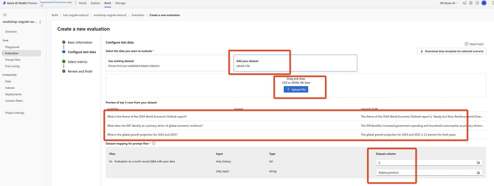
Choose next...
Make sure promptflow can display a "preview" of the data...Leave chat history empty with "[]", and chat input will be the question column in our dataset.

<pre><code>
Below are three lines from our ground_truth dataset.
{"question": "What is the theme of the 2024 World Economic Outlook report?","answer": "","ground_truth": "The theme of the 2024 World Economic Outlook report is 'Steady but Slow: Resilience amid Divergence.'"}
{"question": "What does the IMF identify as a primary driver of global economic resilience?","answer": "","ground_truth": "The IMFidentifies increased government spending and household consumption as primary drivers of global economic resilience."}
{"question": "What is the global growth projection for 2024 and 2025?","answer": "","ground_truth": "The global growth projection for 2024 and 2025 is 3.2 percent for both years."}
</code></pre>

In the next section, we will choose the evaluation metrics and map our eval dataset to inputs required by the selected metrics...
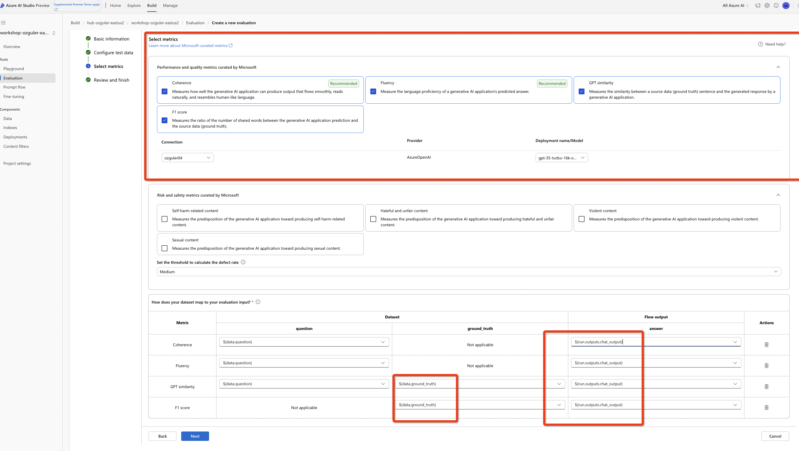
Choose all available evaluation criteria. \
The model that will be used as the "judge" for evaluations (azure openai service connection / model deployment) details...\
Make sure the ground_truth data is designated as ${data.ground_truth}, ground_truth column from our dataset. The answers will be the flow run outputs, ${run.outputs.chat_output}. You will be able to choose them from the drop-down menu...

Finally, progress the box and submit your eval job!

### Eval Results 
Refresh the running eval jobs...
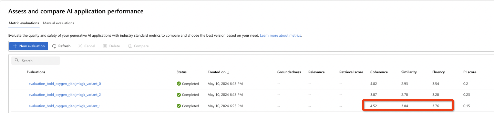

You will see eval results for selected metrics for each variant. \
In this example variant_1 seems to have generated the highest scores for coherence, fluency and similarity...You can now go back to the flow and make variant_1 your default variant.

## Manual Evaluations 
Rather than batch processing eval runs, you can interactively evaluate your prompts against your test data with built in tools to continously iterate and manually review the results.
