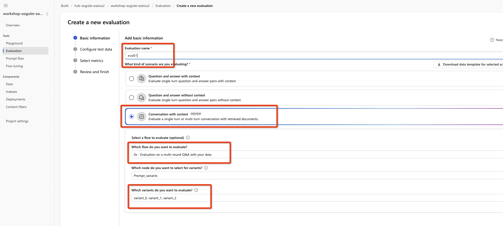
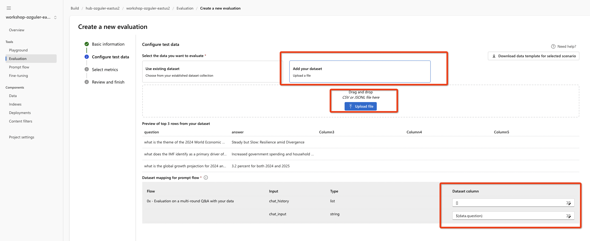
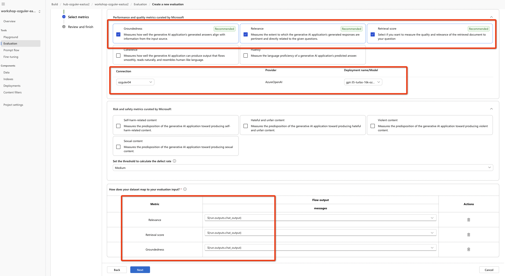

# EVALUATION 

Evaluating generative AI applications is a critical step in ensuring quality and safety, as models like GPT-4 and LLaMA X hold great potential while also posing significant challenges. To navigate these challenges, Azure AI Studio offers a comprehensive suite of tools to assess your AI systems through a structured, iterative process. By starting with manual evaluations, developers can identify and prioritize specific risks and quality issues using small datasets. This initial step provides direct insight into potential biases, misinformation, or security vulnerabilities, allowing practitioners to iteratively refine prompts and apply targeted mitigation measures like content filters. Manual evaluation is particularly valuable for surfacing high-priority issues where ground truth is clear, laying the groundwork for a transition to scalable, automated testing.

Automated evaluation leverages traditional machine learning metrics and AI-assisted evaluations for a robust assessment at scale, enabling continuous quality monitoring as the system evolves. Traditional metrics provide quantitative measures when expected answers are known, while AI-assisted methods allow annotation of attributes such as relevance, coherence, and safety in scenarios where ground truth is unavailable. By simulating adversarial interactions and annotating outputs with GPT-4, Azure AI Studio can identify subtle security risks, measure jailbreak vulnerability, and track performance regressions. This dual-pronged approach provides a comprehensive view of system health, helping developers fine-tune applications with high precision and impact before full-scale deployment. Ultimately, a combination of manual and automated evaluation helps practitioners strike a balance between maximizing the benefits of generative AI while upholding responsible AI principles.

[Please refer to the Azure AI Studio documentation for more](https://learn.microsoft.com/en-us/azure/ai-studio/concepts/evaluation-approach-gen-ai
)...

## CREATING an Automated Evaluation Flow with AI Studio 
Get a multi-step chat flow up and running...
You can use the AI Search index for the IMF Economic Outlook document that was created in earlier steps. e.g. clone the sample flow, attach a runtime, update the LLM and IndexLookup steps. If the connections are in place tool parameters e.g. search index, connections and llm deployments will be explored automatically. 

Run the flow for a test run. The flow tool steps should all look green as in the picture below. Make sure you get a "relevant" response for your question. 

Evaluation can help with prompt engineering, by evaluating each "prompt variant" so that evaluation metrics for each variant can be compared to choose the best prompt variant. (To understand how "prompt variants" work, check the earlier section "Prompt Tuning" and the documentation ["Tune Prompts using Variants in Azure AI Studio"](https://learn.microsoft.com/en-us/azure/ai-studio/how-to/flow-tune-prompts-using-variants).)

Click on the 

Choose an LLM, a base prompt and the number of variants you would like to generate. (Create <5, for the sake of demonstration only 2 variants so that eval runs do not take too long during the workshop. You will have the base prompt + the number of variants e.g. if you chose to create 2 variants you will have 3 prompts including the base prompt in total. You can then promote any of the prompt variants as your base prompt based on eval results and remove the rest if you like...)

Run the flow to confirm all prompt variants work correctly. e.g. go to the variants tool step, choose "show variants" in the base prompt module, find variant_1, make it your base prompt and run the flow. Repeat for variant_2. This is to confirm the generated prompts are in line with the jinja formatted system/user/assistant prompt base. Otherwise during eval runs your prompts will not run. 

e.g.If you get the below error, set your base prompt as the default prompt, delete the variant and create it again. Keep iterating until you make sure all variants when promoted as the default prompt work without any problems...

Save your flow and move onto the next step!

### Creating the Eval Flow 
Next, let's create an **"Evaluation Flow"** as in below...

Choose an eval name, eval type, the variants you would like to evaluate as below...

Next download the ground_truth dataset in "imfgt.csv" from under datasets folder, upload it and let the tool recognize the question and answer columns...In the ground truth data each row corresponds to a q&a pair seperated with a ",". The first row includes the names of the columns in the csv, simply "question" and "answer" in our case.

Choose next...

In the next section, we will choose the metrics we would like to evaluate our generations on. 

Choose the recommended metrics such as "groundedness", "relevance" and the "retrieval_score". \
Choose the AzureOpenAI connection details and the model deployment you would like to use in the evaluation. Ideally the llm you use in your model should be a less capable model than the llm "judge" model you are using in your eval. (Evaluation flows are special prompts which rely on the llm to make a decision for each dimension criteria mentioned.) \
Finally choose your ${run.outputs.chat_output} to be measured...

Finally, progress the box and submit your eval job!
