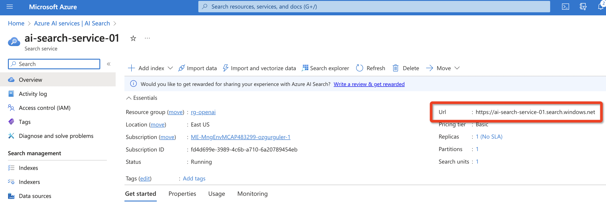

# Standard RAG 

**1. Create a new AI Studio project**

Think of a project as an extended flow, a GenAI App that brings together LLM's, vector indexes, content security filters, PromptFlow flows... 

**2. Create an Azure AI Search Service**
Go to Azure portal and search "Azure AI Search" service (Former Azure Cognitive Search).
Once you are in Azure AI Search, create a new service

Choose a resource-group (create a new one if doesn't exist). \
"Basic" or "Free" tier will suffice for the purposes of this lab.

**3. Create a connection for the Azure AI Search service** \
PromptFlow uses "connections" to access vector indexes, vector db's, LLM's (both AzureOpenAI, models deployed through model catalog or external models from other vendors), embeddings models and other Azure services such as Azure Content Safety and Azure Cognitive Services.

PromptFlow will need to access to the "AI Search" service to initially create the vector index for document embeddings. It will then use the same connection to search the vector index for finding relevant document parts and creating the context for a given prompt.

To create the connection for the Azure AI Search service...

Copy the AI Search service url from the AI Search service "overview" tab. 

While on the AI Search portal page, click on "keys" from the menu on the left. Copy the API key.

Go back to Azure AI Studio. From the top horizontal menu, choose "Manage". \
Click on "New Connection".

Next add the endpoint URL, the API key copied earlier and a connection name. 
(API version for AI Search connection needs to be 2023-07-01-preview or later for vector store support.)

**4. Create connections for embeddings model and the LLM** \
To create embeddings for document chunks our flow will need to use an embeddings model. We need to create a connection for the embeddings model and the LLM to drive the RAG flow.

**5. Create a vector index with Azure PromptFlow**

**6. Deploy the flow to Azure as an LLM app**
