# Standard RAG 

**1. Create a new AI Studio project**

Think of a project as an extended flow, a GenAI App that brings together LLM's, vector indexes, content security filters, PromptFlow flows... 
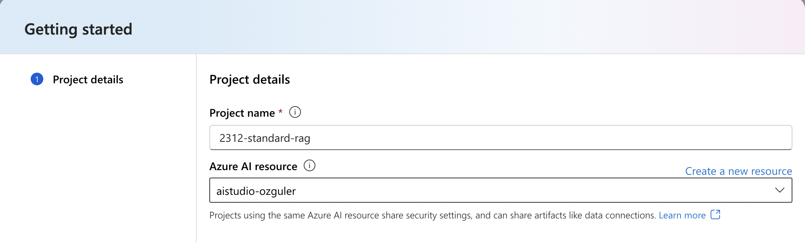

**2. Create an Azure AI Search Service**
Go to Azure portal and search "Azure AI Search" service (Former Azure Cognitive Search).
Once you are in Azure AI Search, create a new service

Choose a resource-group (create a new one if doesn't exist). \
"Basic" or "Free" tier will suffice for the purposes of this lab.

**3. Create a connection for the Azure AI Search service** \
PromptFlow uses "connections" to access vector indexes, vector db's, LLM's (both AzureOpenAI, models deployed through model catalog or external models from other vendors), embeddings models and other Azure services such as Azure Content Safety and Azure Cognitive Services.

PromptFlow will need to access to the "AI Search" service to initially create the vector index for document embeddings. It will then use the same connection to search the vector index for finding relevant document parts and creating the context for a given prompt.

To create the connection for the Azure AI Search service...

Copy the AI Search service url from the AI Search service "overview" tab. 

While on the AI Search portal page, click on "keys" from the menu on the left. Copy the API key.

Go back to Azure AI Studio. From the top horizontal menu, choose "Manage". \
Click on "New Connection".
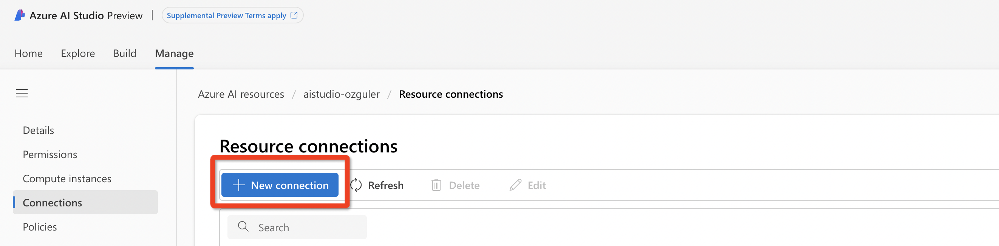

Next add the endpoint URL, the API key copied earlier and a connection name. 
(API version for AI Search connection needs to be 2023-07-01-preview or later for vector store support.)
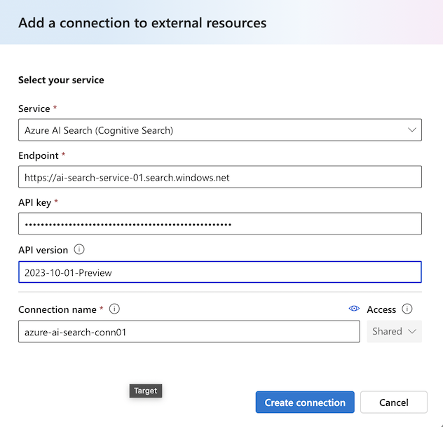

**4. Create AzureOpenAI deployments for the embeddings model and the openai gpt model of choice** \
AzureAI Studio by default will recognize deployed models under Azure OpenAI. 
If you don't see these models under Azure AI Studio create them following the below.
To create embeddings for document chunks our flow will need to use an embeddings model. We need to create a connection for the embeddings model and the LLM to drive the RAG flow.

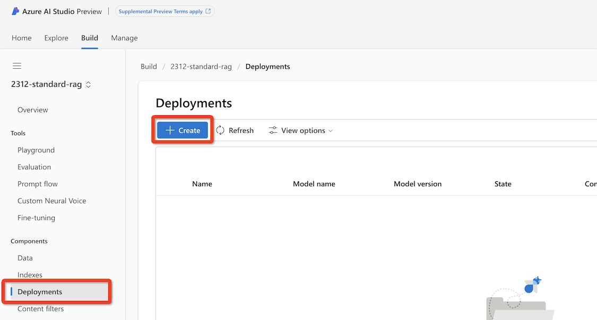

Next choose the text-embedding-ada-002 model to create the embeddings...
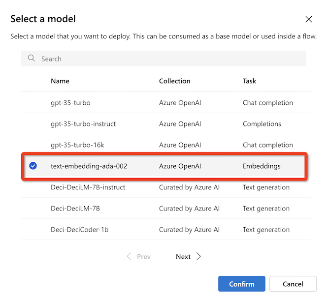

Choose model version 2 and set 120k TPM quota for the deployment so that we do not exhaust the whole 240k TPM regional quota. Then click "Deploy".
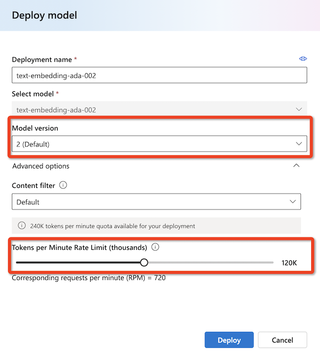

Copy the deployments API key...

Repeat the same steps to deploy gpt-35-turbo-16k model for chat completions.
At the you will have two deployments. One for embeddings and got-35-turbo 16k for chat completions.
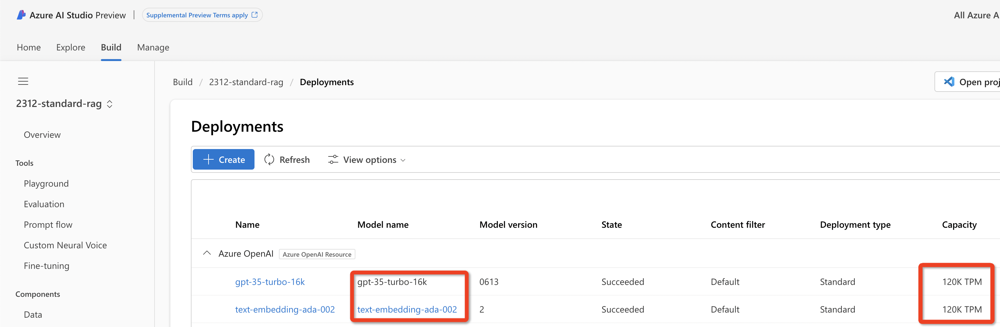

**5. Create connections for embeddings model and the LLM of choice** \
Go back to Azure AI Studio Manage/Connections/New Connection, choose AzureOpenAI service from the services menu and add the endpoint and API key details that were recorded in the previous step...

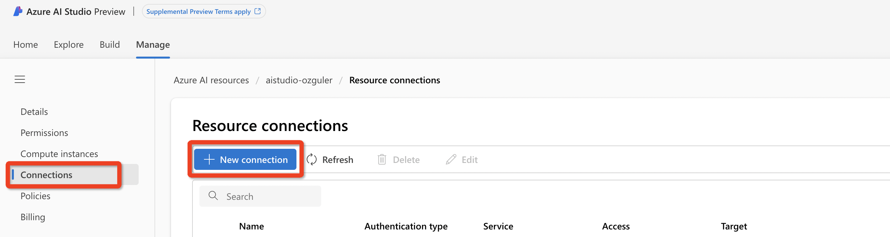

add the API endpoint and key details for gpt-35-turbo 16k model deployment.
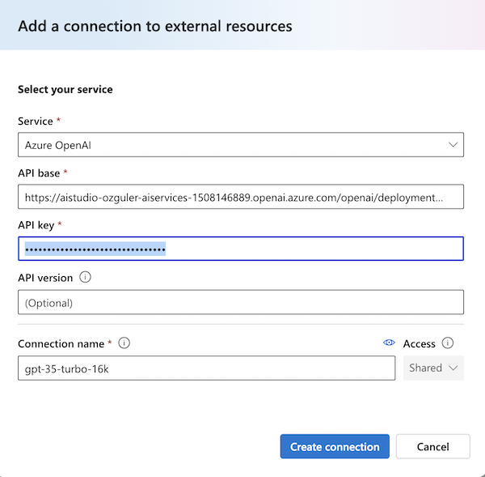

You won't need to create a connection for the embedding model ada-embedding-02 deployment. 

**6. Create a vector index in Azure AI Studio**
Go to Azure AI Studio/Build/Indexes and Click on "New Index".
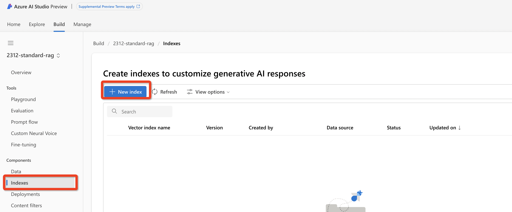
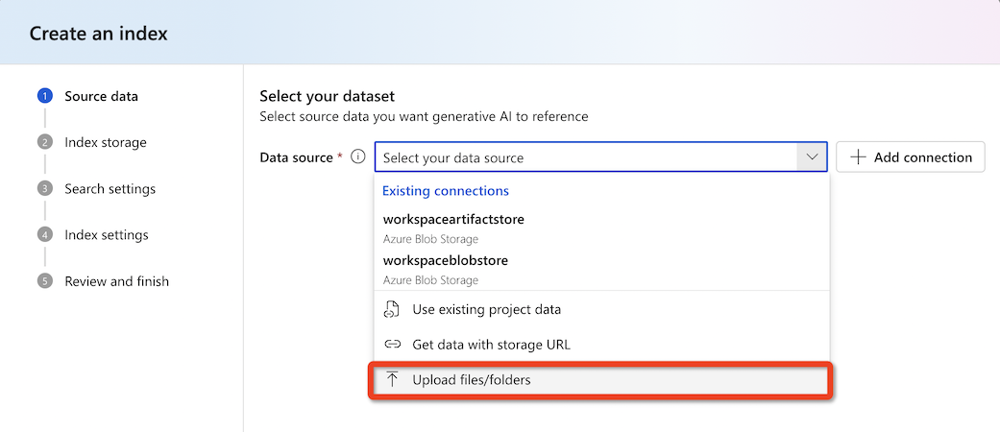

Choose and upload a .pdf file. (You can use the IMF World Economy Outlook document under datasets)
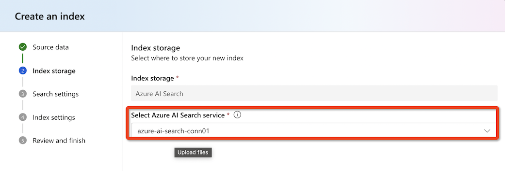

Next AI Studio will look for the embeddings model deployment. If not removed Azure AI Studio comes with default embedding model deployments. If this has been removed it can look for and locate an available embedding model and finally if it cannot it can create a new deployment model itself. In this example AI Studio will use the deployment used in the previous step.
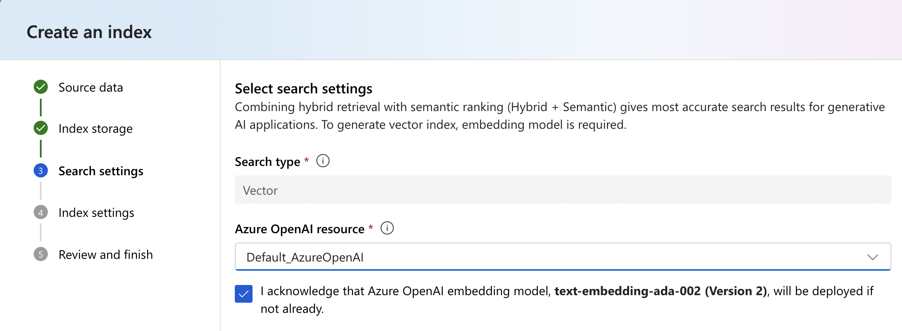

Next we will create an index on Azure AI Search for document embeddings. \
(Do not use hyphen or underscore for the index name.)
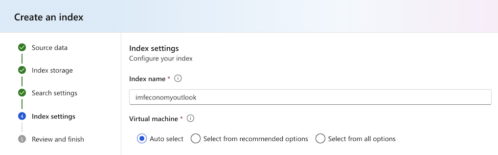

Finally choose "Create" so that index creation starts...
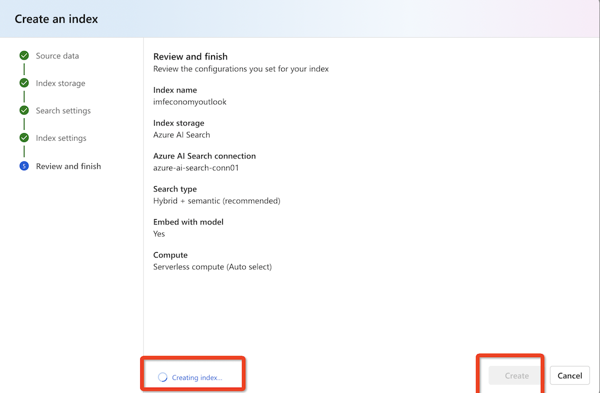

You can follow index creation pipeline under Azure AI ML Studio jobs.
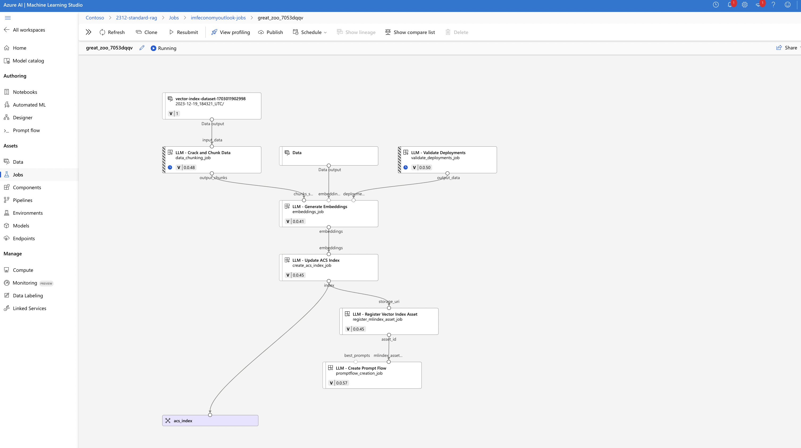
**7. Deploy the flow to Azure as an LLM app**

monitor usage...
