# Standard RAG 

In this lab we will create a vanilla RAG pipeline. \
We will first create a vector index and then use automated flow generation function to create the chatbot. \
Finally we will deploy the chatbot onto Azure as a webapp. 

**1. Create a new AI Studio project**

A project is an organizational container that has tools for AI customization and orchestration, lets you organize your work, save state across different tools like prompt flow, and collaborate with others. For example, you can share uploaded files and connections to data sources.

Think of a project as a container that brings together all necessary components required to build a GenAI App e.g. LLM's, vision/speech models, Azure Cognitive / AI services (e.g. speech / language / vision services), datasets, vector indexes, vector db's, content security filters, PromptFlow flows (e.g. evaluation flows)... 
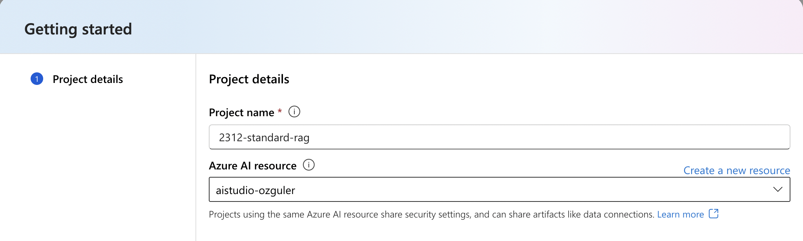

For more please see [MSLearn documentation](https://learn.microsoft.com/en-us/azure/ai-studio/concepts/ai-resources#organize-work-in-projects-for-customization).

**2. Create an Azure AI Search Service**
Go to Azure portal and search "Azure AI Search" service (Former Azure Cognitive Search).
Once you are in Azure AI Search, create a new service

Choose a resource-group (create a new one if doesn't exist). \
"Basic" or "Free" tier will suffice for the purposes of this lab.

**3. Create a connection for the Azure AI Search service** \
PromptFlow uses "connections" to access vector indexes, vector db's, LLM's (both AzureOpenAI, models deployed through model catalog or external models from other vendors), embeddings models and other Azure services such as Azure Content Safety and Azure Cognitive Services.

PromptFlow will need to access to the "AI Search" service to initially create the vector index for document embeddings. It will then use the same connection to search the vector index for finding relevant document parts and creating the context for a given prompt.

To create the connection for the Azure AI Search service...

Copy the AI Search service url from the AI Search service "overview" tab. 
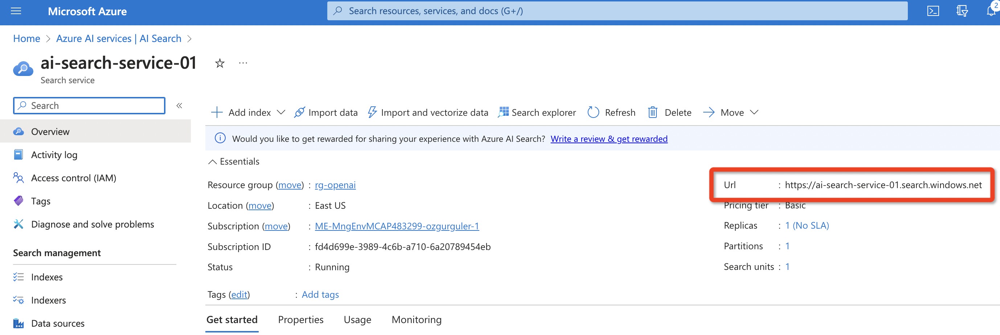

While on the AI Search portal page, click on "keys" from the menu on the left. Copy the API key.

Go back to Azure AI Studio. From the top horizontal menu, choose "Manage". \
Click on "New Connection".
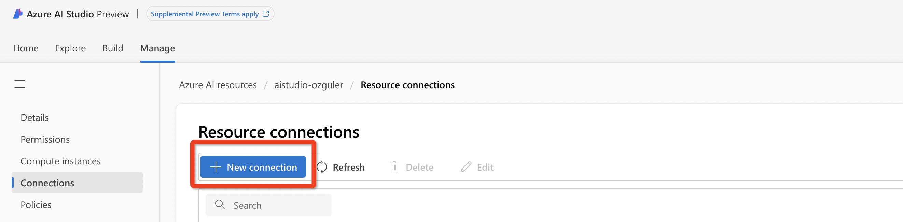

Next add the endpoint URL, the API key copied earlier and a connection name. 
(API version for AI Search connection needs to be 2023-07-01-preview or later for vector store support.)
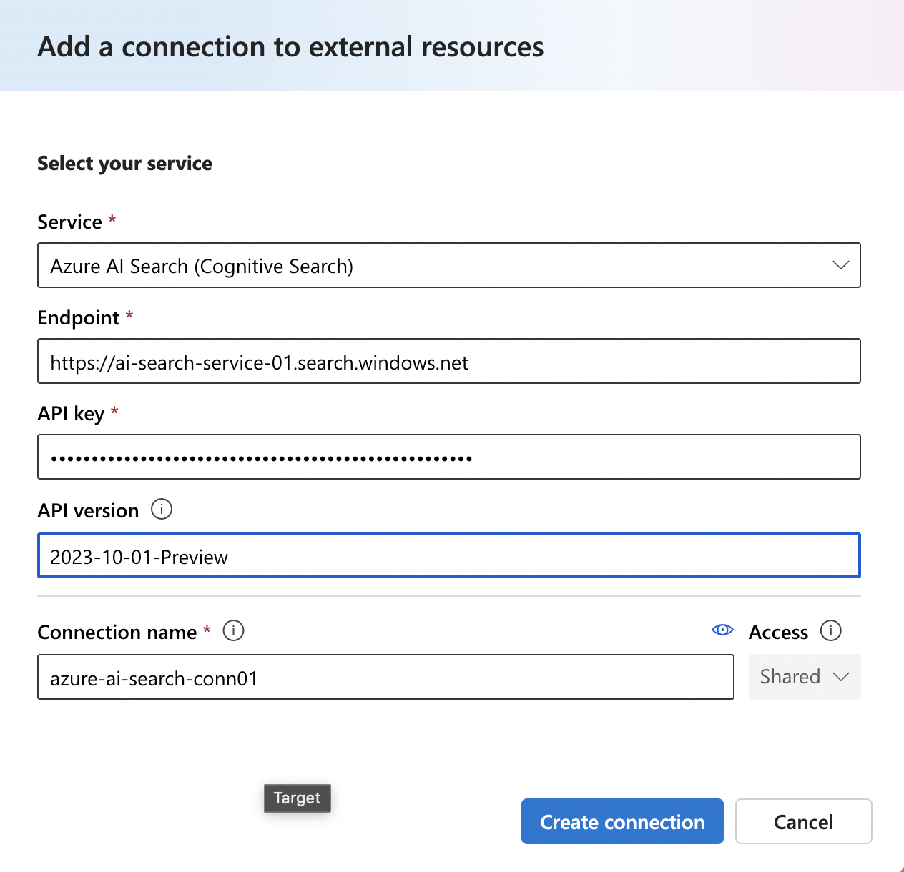

**4. Create AzureOpenAI deployments for the embeddings model and the openai gpt model of choice** \
AzureAI Studio by default will recognize deployed models under Azure OpenAI service. 
If you don't see these models under Azure AI Studio create these model deployments from scratch.

First create an AzureOpenAI service from under Azure portal AzureOpenAI service.
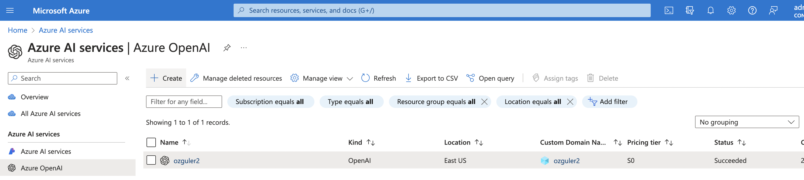

Once the service is completed, go into the service and note down the API endpoint and API key for the created AzureOpenAI service.
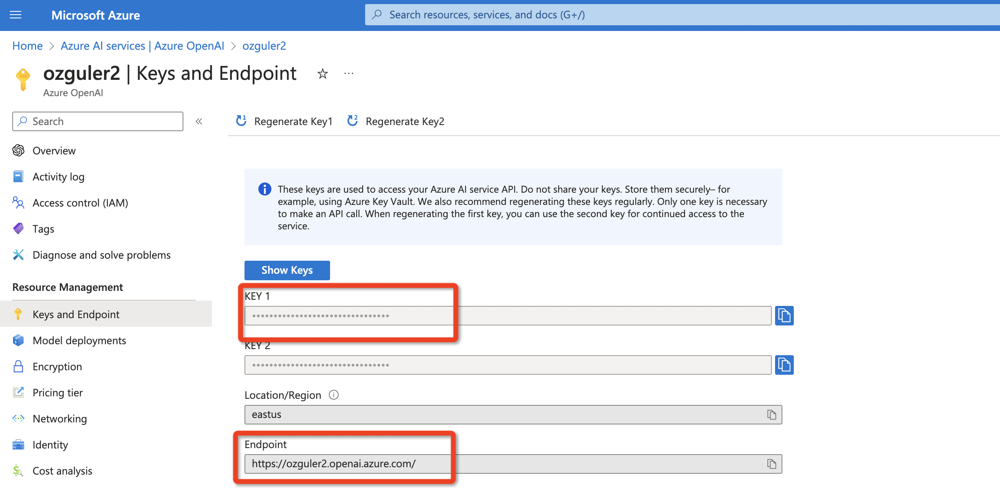

Go back to AzureOpenAI service overview and click on "Go to AzureOpenAI Studio" to deploy the required models under the created service.
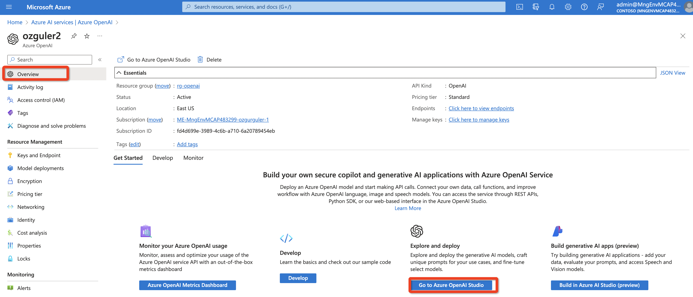

On AzureOpenAI Studio create two deployments. 
1. embeddings-ada-02 embedding model
2. gpt-35-turbo 16k as the LLM of choice
Do not assign all of the regional quotas (120k TPM - half of the regional quota) will suffice.

In the end you will see the models on AzureOpenAI portal under deployments.
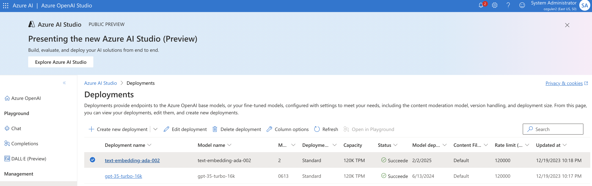

**5. Create a connection for the AzureOpenAI servicee** \
(If the AzureAI Studio Project was created after an AzureOpenAI service was created the connections for AOAI service are automatically created with the name "Default_AzureOpenAI" connection. Make sure the required models are deployed under this service under AOAI. If the default AOAI connection does not work try creating a new AOAI connection )
Go back to Azure AI Studio Manage/Connections/New Connection, choose AzureOpenAI service from the services menu and add the endpoint and API key details that were recorded in the previous step...

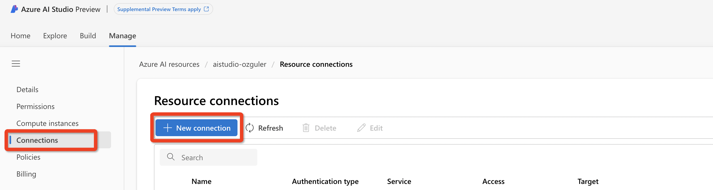

add the API endpoint and key details for gpt-35-turbo 16k model deployment.
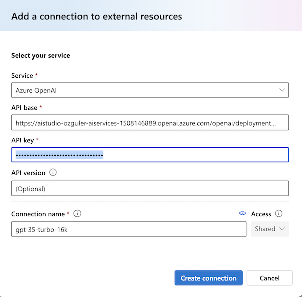

You won't need to create a connection for the embedding model ada-embedding-02 deployment. 

**6. Create a vector index in Azure AI Studio**
Go to Azure AI Studio/Build/Indexes and Click on "New Index".

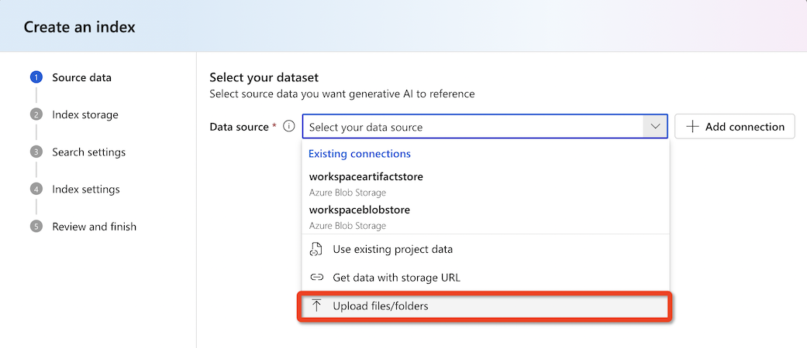

Choose and upload a .pdf file. (You can use the IMF World Economy Outlook document under datasets)
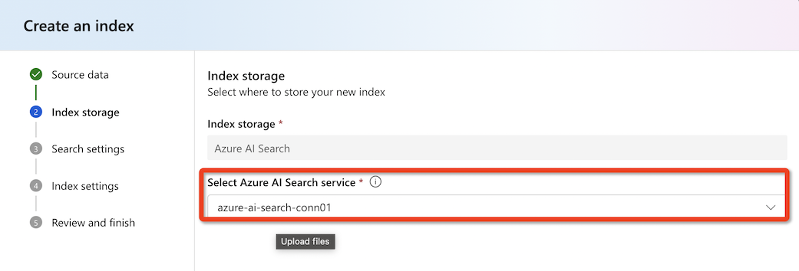

Next AI Studio will look for the embeddings model deployment. If not removed Azure AI Studio comes with default embedding model deployments. If this has been removed it can look for and locate an available embedding model and finally if it cannot it can create a new deployment model itself. In this example AI Studio will use the deployment used in the previous step.
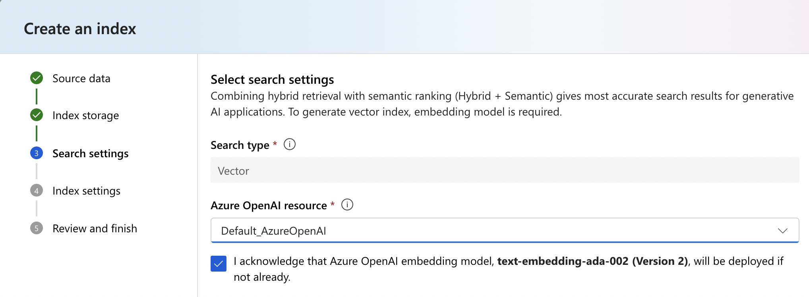

Next we will create an index on Azure AI Search for document embeddings. \
(Do not use hyphen or underscore for the index name.)
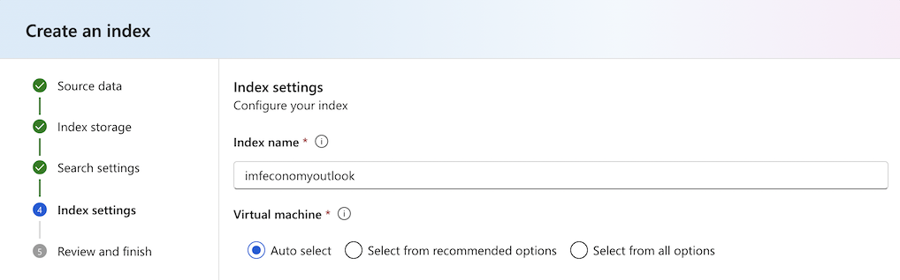

Finally choose "Create" so that index creation starts...
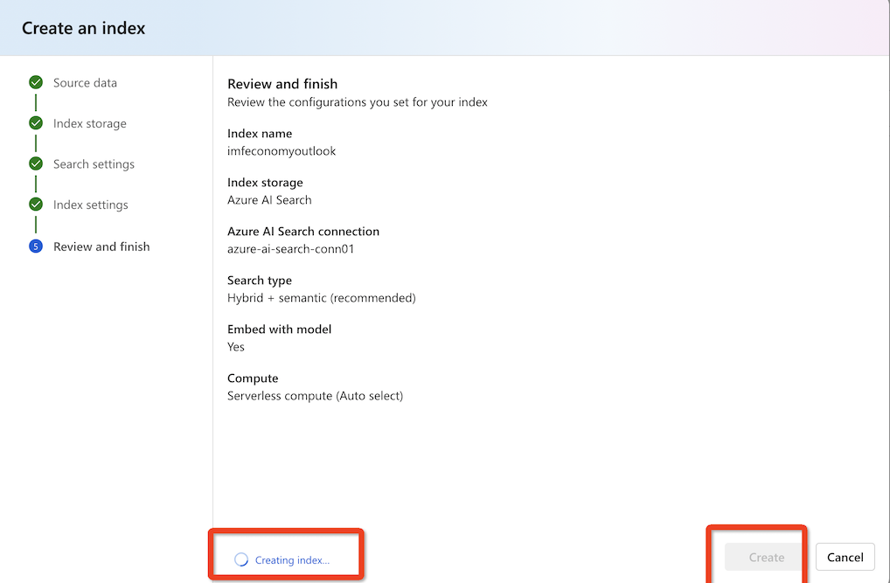

You can follow index creation pipeline under Azure AI ML Studio jobs.
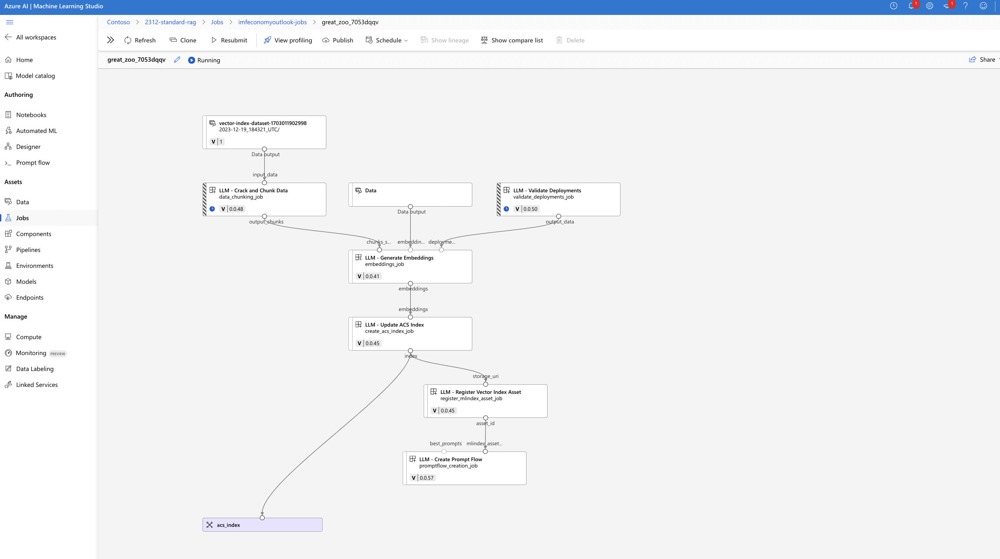
**7. Deploy the flow to Azure as an LLM app**

monitor usage...
