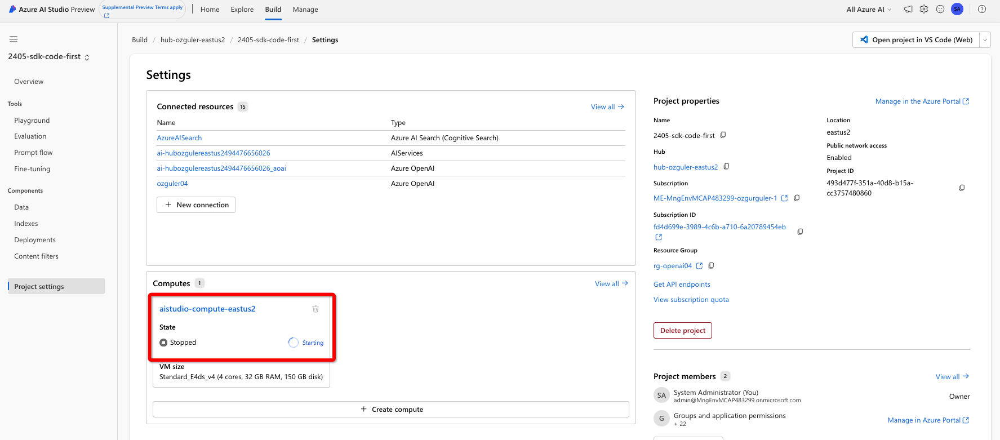
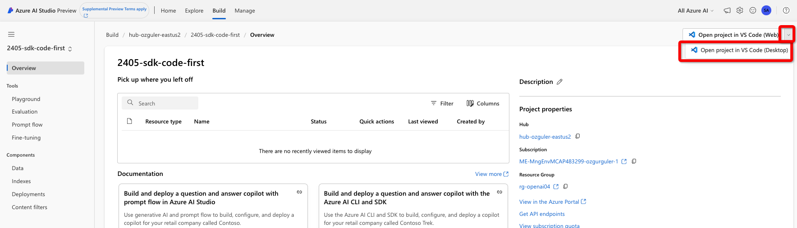
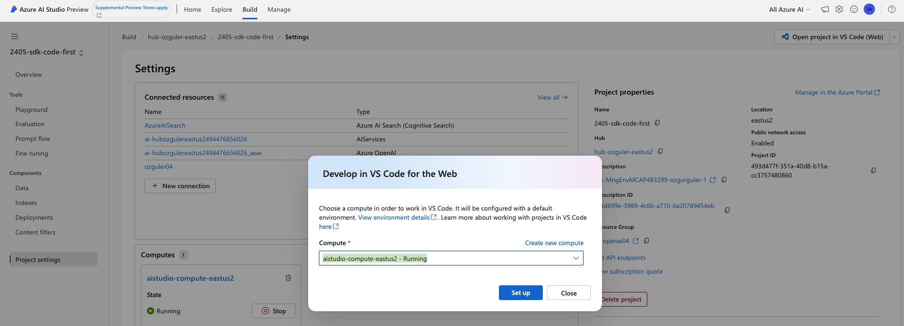
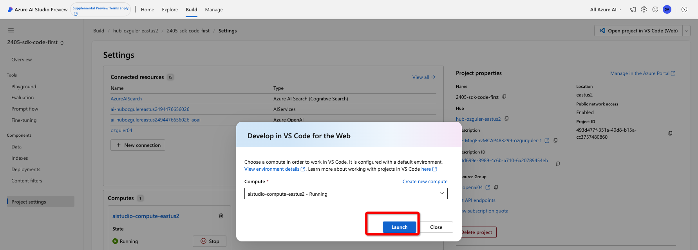
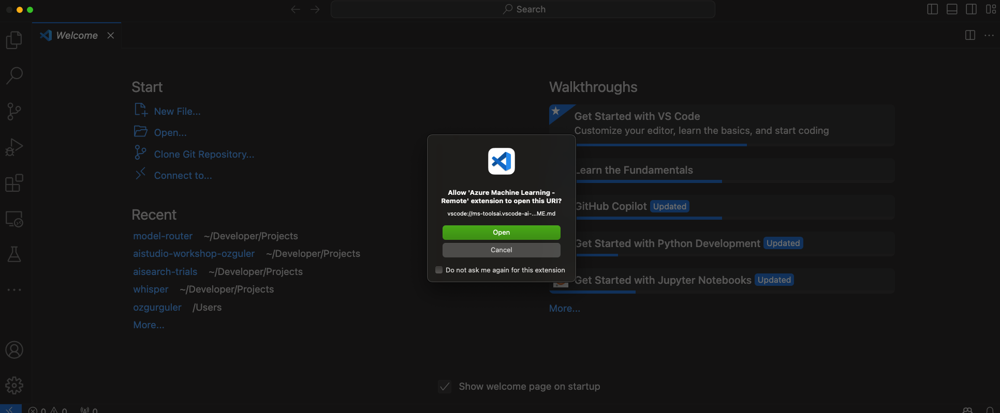
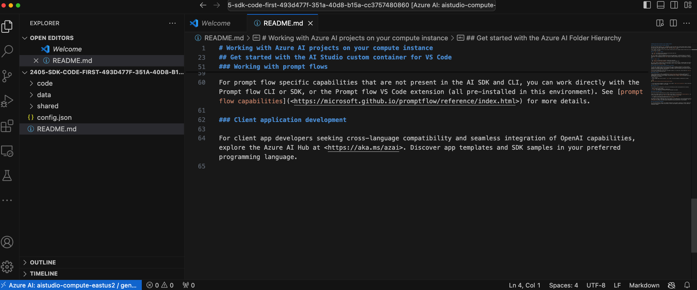

# Code-first 

First create an Azure AI Studio Hub resource by following [Setting Up The Environment](../Lab1%20-%20WikiPediaChatApp/1.1SettingUptheEnv.md). Make sure an Azure AI Studio Project has been successfully launched.

You can launch a new project via the Home page too...

Make sure there is a running VM within the project, via project settings. Launch a new VM or restart an existing VM if created before. AI Studio / VS Code integration leverages VS Code Remote Development which runs a remote dev container within the Project VM and lets your client VS Code instance remotely run code on the server over an automatically set up SSH tunnel. All config & setup is automatically done by AI Studio. Please follow the below steps to get your local VSCode env up and running!

Once launched, open the project in VSCode by clicking on the button on top right. (First click on the pop down menu and choose "Open Project in VS Code" (Desktop). Otherwise by default it will be launched in your Web browser.)

Choose the active VM (should have a green button next to it) and press the "Set Up" button. It will take a couple of minutes for the environment to be set up.

Finally when the setup completes click on "Launch".

Allow the VS Code App to be launched.

Choose your Azure subscription and AI Studio will configure your project VM as a remote development server and log you in.

Finally you will have your dev environment ready!
 

Bonus Content: \
Have a look at the tutorial at MS Learn [Tutorial: Build and deploy a question and answer copilot with the Azure AI CLI and SDK](https://learn.microsoft.com/en-us/azure/ai-studio/tutorials/deploy-copilot-sdk)

Other ways you can use Azure AI SDK...\
Option2 Visual Studio Code Dev Container \
Option3 GitHub Workspaces 
Follow the [documentation](https://learn.microsoft.com/en-us/azure/ai-studio/how-to/sdk-install?tabs=linux) to go forward with Option2/3.