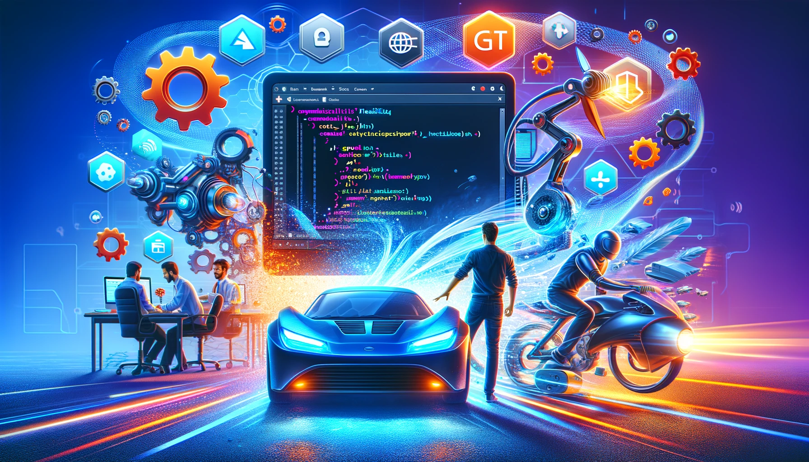

# Why prefer "code-first" development with Azure AI SDK over AI Studio UI?

"Code First" development with Azure SDK offers significant advantages over simple UI-based development due to its flexibility and control, version control and collaboration, and reusability and automation. By writing code, developers can achieve fine-grained customization and implement complex logic that might be challenging or impossible through a UI. This approach also enables the use of source control systems like Git, allowing for effective tracking of changes, collaborative efforts, and the ability to roll back to previous versions if needed. Code reviews through pull requests ensure high-quality code and adherence to best practices. Moreover, code-first development promotes the reuse of components and modules across different projects, reducing redundancy and increasing efficiency. Automation is another key benefit, as infrastructure and deployments can be scripted and automated, leading to more consistent and reliable processes.

# Preparing the Dev Environment

First create an Azure AI Studio Hub resource by following [Setting Up The Environment](../../Lab1%20-%20WikiPediaChatApp/1.1SettingUptheEnv.md). \
Make sure an Azure AI Studio Project has been successfully launched.

You can launch a new project via the Home page too...

Make sure there is a running VM within the project. You can check weather there is a running VM that you can attach to your flows via project settings on the left vertical menu. *(You may need to create a new VM if non has been created before.)*

You can launch a new VM or restart an existing VM if one exists. AI Studio / VS Code integration leverages "VS Code Remote Developmen"t" which runs a remote prebuilt custom dev container within the Project Virtual Machine that has Azure AI SDK installed. This lets your client VS Code instance remotely run code on the custom container over an automatically set up ssh tunnel. Prebuilt development environments are based on a docker container that has the **Azure AI SDK generative packages, the Azure AI CLI, the Prompt flow SDK**, and other tools.  All config & setup is automatically done by AI Studio. Please follow the below steps to get your local VSCode env up and running!

While in the project, choose the </>Code Tool on the left vertical menu...

Choose "Open Project in VS Code (Desktop)" from the menu...

This will launch your local VSCode, install VSCode Server on the project VM and remotely connect your local dev environment to your Azure AI Studio Project...

Finally you will have your dev environment ready! \
The good thing is you will not need to configure your subscription, hub or project details and login remotely. \
Everything will be handled automatically for you.

If you would like to work interactively run "ai help" in the terminal...

Bonus Content: \
Have a look at the tutorial at MS Learn [Tutorial: Build and deploy a question and answer copilot with the Azure AI CLI and SDK](https://learn.microsoft.com/en-us/azure/ai-studio/tutorials/deploy-copilot-sdk)

Other ways you can use Azure AI SDK...\
Option2 Visual Studio Code Dev Container \
Option3 GitHub Workspaces 
Follow the [documentation](https://learn.microsoft.com/en-us/azure/ai-studio/how-to/sdk-install?tabs=linux) to go forward with Option2/3.