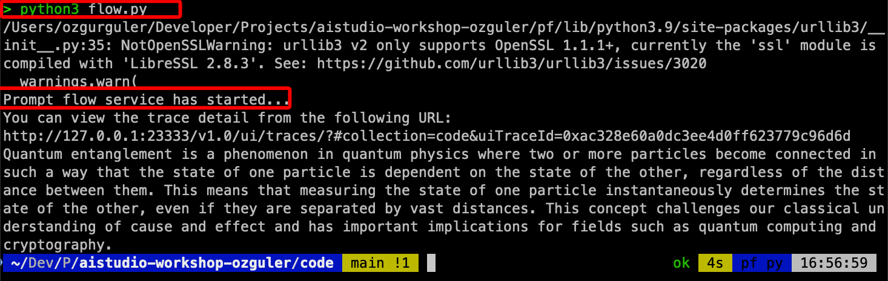
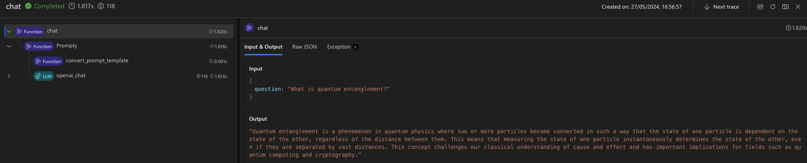

# First App with PF SDK 

Prompty is announced at MS Build 2024, intends to turn prompts to coding assets. Prompty is designed to simplify the development of prompt templates.
Refer to [Prompty.md] for more...

Make sure .env file is created in the same folder and includes the AzureOpenAI endpoint and key details in it.


## Create your prompt as a Prompty file
```
---
name: Minimal Chat
model:
  api: chat
  configuration:
    type: azure_openai
    azure_deployment: gpt-35-turbo
  parameters:
    temperature: 0.2
    max_tokens: 1024
inputs:
  question:
    type: string
sample:
  question: "What is Prompt flow?"
---

system:
You are a helpful assistant.

user:
{{question}}
```

## Create a Flow 

```
import os

from dotenv import load_dotenv
from pathlib import Path
from promptflow.tracing import trace
from promptflow.core import Prompty

BASE_DIR = Path(__file__).absolute().parent

@trace
def chat(question: str = "What's the capital of France?") -> str:
    """Flow entry function."""

    if "OPENAI_API_KEY" not in os.environ and "AZURE_OPENAI_API_KEY" not in os.environ:
        # load environment variables from .env file
        load_dotenv()

    prompty = Prompty.load(source=BASE_DIR / "chat.prompty")
    # trigger a llm call with the prompty obj
    output = prompty(question=question)
    return output

if __name__ == "__main__":
    from promptflow.tracing import start_trace

    start_trace()

    result = chat("What is quantum entanglement?")
    print(result)
```

The flow.py script is designed to interact with an Azure OpenAI deployment using the PromptFlow framework. It begins by importing necessary modules and setting up the base directory. The script defines a chat function, decorated with @trace for execution tracing, which accepts a question, checks for required API keys in the environment, and loads them from a .env file if they are missing. The function then loads a PromptFlow configuration from a .prompty file and uses it to generate a response to the input question by calling the deployment. When run as a main program, the script starts tracing, calls the chat function with the question “What is quantum entanglement?”, and prints the resulting answer. This setup allows for dynamic input handling and interaction with a specified LLM deployment, facilitating easy testing and debugging of the flow.



Copy the tracing URL given and visit the URL with your browser...


[Home](../../../README.md)